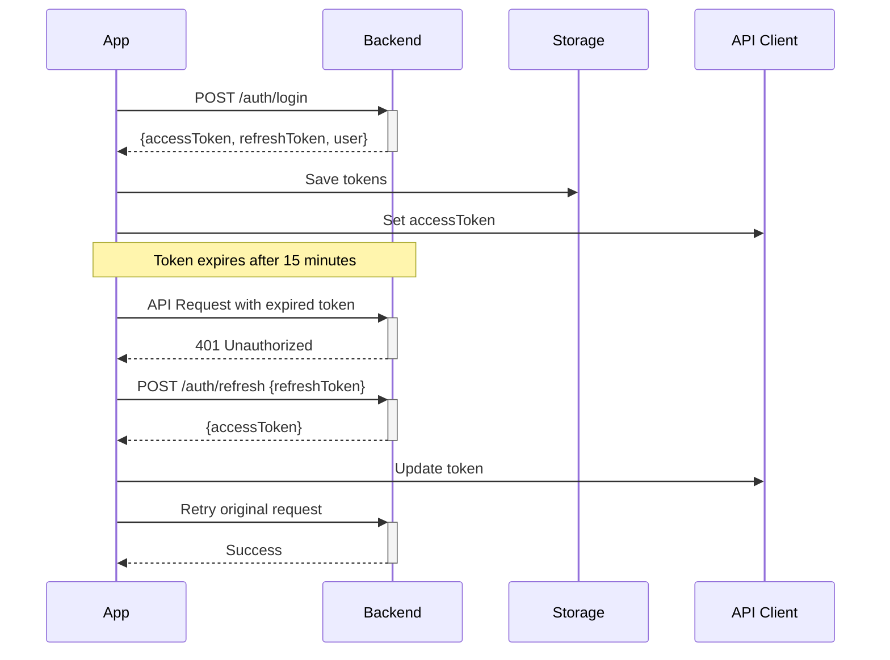

# API Integration Guide - Mobile App

**Last Updated**: December 11, 2025  
**Backend API**: https://baotienweb.cloud/api/v1  
**Status**: ✅ Production Ready (70% Integration Complete)

## 📚 Overview

Complete guide for integrating with the ThietKeResort backend API. This document covers authentication, API endpoints, error handling, and best practices.

**Quick Links**:
- [Authentication](#authentication) - Login, token refresh, roles
- [API Endpoints](#api-endpoints) - All available endpoints
- [Error Handling](#error-handling) - Error types and recovery
- [Testing](#testing) - Test accounts and scenarios

---

## 🏗️ Architecture

### Core Components

```
services/
├── api.ts                    # Core API client with auto-retry
├── api/
│   ├── authApi.ts           # ✅ Authentication (login, register, profile)
│   ├── servicesApi.ts       # ✅ Services marketplace
│   ├── projectsApi.ts       # ✅ Projects management
│   ├── tasksApi.ts          # ✅ Tasks management
│   └── notificationsApi.ts  # ✅ Notifications

hooks/
├── useAuth.ts               # ✅ Auth context hook
├── useServices.ts           # ✅ Services with error handling
├── useProjects.ts           # ✅ Projects with retry
├── useTasks.ts              # ✅ Tasks CRUD operations
├── useNotifications.ts      # ✅ Notifications with badges
└── useProfile.ts            # ✅ User profile data

components/ui/
├── error-message.tsx        # ✅ Smart error display
├── loader.tsx               # ✅ Loading states
└── skeleton.tsx             # ✅ Skeleton screens

context/
└── AuthContext.tsx          # ✅ Global auth state
```

### API Configuration

```typescript
// config/env.ts
export default {
  API_BASE_URL: 'https://baotienweb.cloud/api/v1',
  API_KEY: 'thietke-resort-api-key-2024',
  API_TIMEOUT: 30000, // 30 seconds
};
```

---

## 🔐 Authentication

### Authentication Flow



### 1. Login

**Endpoint**: `POST /auth/login`  
**Access**: Public  
**Description**: Authenticate user and receive tokens

**Request**:
```typescript
import { login } from '@/services/api/authApi';

async function handleLogin() {
  try {
    const response = await login({
      email: 'client.test@demo.com',
      password: 'Test123456'
    });

    console.log('User registered:', response.user);
    console.log('Access token:', response.accessToken);
    // Tokens are automatically stored in SecureStore
  } catch (error) {
    console.error('Registration failed:', error);
  }
}
```

### 2. Đăng nhập

```typescript
import { login } from '@/services/authApi.new';

async function handleLogin() {
  try {
    const response = await login({
      email: 'user@example.com',
      password: 'password123',
    });

    console.log('Logged in:', response.user);
    // Tokens stored automatically
  } catch (error) {
    console.error('Login failed:', error);
  }
}
```

```

---

## 📋 API Endpoints Reference

### Projects API

#### 1. Get All Projects

**Endpoint**: `GET /projects`  
**Access**: Protected (CLIENT, ENGINEER, ADMIN)  
**Description**: Fetch user's projects with optional filters

**Request**:
```typescript
import { useProjects } from '@/hooks/useProjects';

function ProjectsScreen() {
  const { projects, loading, error, retrying, refresh } = useProjects();

  if (loading) return <Loader text="Loading projects..." />;
  if (error) return <ErrorMessage error={error} onRetry={refresh} />;

  return (
    <FlatList
      data={projects}
      renderItem={({ item }) => <ProjectCard project={item} />}
      refreshControl={
        <RefreshControl refreshing={retrying} onRefresh={refresh} />
      }
    />
  );
}

**Response** (`200 OK`):
```json
[
  {
    "id": "1",
    "name": "Beach Resort Design",
    "description": "Luxury resort project in Da Nang",
    "status": "ACTIVE",
    "budget": 5000000000,
    "startDate": "2025-01-01T00:00:00.000Z",
    "endDate": "2025-12-31T23:59:59.000Z",
    "progress": 35,
    "owner": {
      "id": 15,
      "fullName": "Client Demo",
      "email": "client.test@demo.com"
    },
    "createdAt": "2024-11-01T10:00:00.000Z"
  }
]
```

**Status Mapping** (backend → UI):
- `ACTIVE` → `In Progress`
- `COMPLETED` → `Completed`
- `CANCELLED` → `Cancelled`
- `PENDING` → `Pending`

---

#### 2. Get Project by ID

**Endpoint**: `GET /projects/:id`  
**Access**: Protected (project owner/members only)  
**Description**: Fetch detailed project information

**Request**:
```typescript
import { getProjectById } from '@/services/api/projectsApi';

async function loadProject(id: string) {
  try {
    const project = await getProjectById(id);
    console.log('Project:', project.name);
  } catch (error) {
    console.error('Failed to load project:', error);
  }
}
```

**Response** (`200 OK`):
```json
{
  "id": "1",
  "name": "Beach Resort Design",
  "description": "Luxury resort project in Da Nang",
  "status": "ACTIVE",
  "budget": 5000000000,
  "startDate": "2025-01-01T00:00:00.000Z",
  "endDate": "2025-12-31T23:59:59.000Z",
  "progress": 35,
  "owner": {
    "id": 15,
    "fullName": "Client Demo",
    "email": "client.test@demo.com",
    "role": "CLIENT"
  },
  "members": [
    {
      "id": 16,
      "fullName": "Engineer Demo",
      "role": "ENGINEER"
    }
  ],
  "tasks": [
    {
      "id": "101",
      "title": "Site survey",
      "status": "COMPLETED"
    }
  ],
  "createdAt": "2024-11-01T10:00:00.000Z",
  "updatedAt": "2025-12-10T14:30:00.000Z"
}
```

---

### Tasks API

#### 1. Get All Tasks

**Endpoint**: `GET /tasks`  
**Access**: Protected (ENGINEER, ADMIN)  
**Description**: Fetch all tasks (admin view)

**Request**:
```typescript
import { useTasks } from '@/hooks/useTasks';

function AllTasksScreen() {
  const { tasks, loading, error, retrying, refresh } = useTasks();

  if (loading) return <Loader text="Loading tasks..." />;
  if (error) return <ErrorMessage error={error} onRetry={refresh} />;

  return <TaskList tasks={tasks} />;
}
```

**Response** (`200 OK`):
```json
[
  {
    "id": "101",
    "title": "Complete site survey",
    "description": "Survey the construction site and document findings",
    "status": "IN_PROGRESS",
    "priority": "HIGH",
    "projectId": "1",
    "assigneeId": 16,
    "assignee": {
      "id": 16,
      "fullName": "Engineer Demo",
      "role": "ENGINEER"
    },
    "dueDate": "2025-12-20T23:59:59.000Z",
    "createdAt": "2025-12-01T09:00:00.000Z"
  }
]
```

---

#### 2. Get My Tasks

**Endpoint**: `GET /tasks/my-tasks`  
**Access**: Protected (ENGINEER)  
**Description**: Fetch tasks assigned to current user

**Request**:
```typescript
import { useMyTasks } from '@/hooks/useTasks';

function MyTasksScreen() {
  const { tasks, loading, error, retrying, refresh, updateTaskStatus } = useMyTasks();

  const handleComplete = async (taskId: string) => {
    await updateTaskStatus(taskId, 'COMPLETED');
    refresh();
  };

  if (loading) return <Loader text="Loading your tasks..." />;
  if (error) return <ErrorMessage error={error} onRetry={refresh} />;

  return (
    <FlatList
      data={tasks}
      renderItem={({ item }) => (
        <TaskCard task={item} onComplete={() => handleComplete(item.id)} />
      )}
    />
  );
}
```

**Response** (`200 OK`):
```json
[
  {
    "id": "102",
    "title": "Review architectural plans",
    "status": "PENDING",
    "priority": "MEDIUM",
    "projectId": "1",
    "dueDate": "2025-12-18T23:59:59.000Z"
  }
]
```

---

### Notifications API

#### 1. Get All Notifications

**Endpoint**: `GET /notifications`  
**Access**: Protected (all roles)  
**Description**: Fetch user's notifications with unread count

**Request**:
```typescript
import { useNotifications } from '@/hooks/useNotifications';

function NotificationsScreen() {
  const {
    notifications,
    unreadCount,
    loading,
    error,
    retrying,
    refresh,
    markAsRead,
    markAllAsRead,
    deleteNotification
  } = useNotifications();

  if (loading) return <Loader text="Loading notifications..." />;
  if (error) return <ErrorMessage error={error} onRetry={refresh} />;

  return (
    <View>
      <Text>Unread: {unreadCount}</Text>
      <Button title="Mark All Read" onPress={markAllAsRead} />
      <FlatList
        data={notifications}
        renderItem={({ item }) => (
          <NotificationCard
            notification={item}
            onPress={() => markAsRead(item.id)}
            onDelete={() => deleteNotification(item.id)}
          />
        )}
      />
    </View>
  );
}
```

**Response** (`200 OK`):
```json
[
  {
    "id": "201",
    "title": "New task assigned",
    "message": "You have been assigned to: Complete site survey",
    "type": "TASK_ASSIGNED",
    "isRead": false,
    "userId": 16,
    "createdAt": "2025-12-11T10:30:00.000Z",
    "data": {
      "taskId": "101",
      "projectId": "1"
    }
  },
  {
    "id": "202",
    "title": "Project updated",
    "message": "Beach Resort Design status changed to In Progress",
    "type": "PROJECT_UPDATE",
    "isRead": true,
    "userId": 16,
    "createdAt": "2025-12-10T14:20:00.000Z"
  }
]
```

**Notification Types**:
- `TASK_ASSIGNED` - New task assigned to user
- `TASK_COMPLETED` - Task marked as complete
- `PROJECT_UPDATE` - Project status/details changed
- `COMMENT_ADDED` - New comment on project/task
- `SYSTEM` - System announcements

---

#### 2. Mark Notification as Read

**Endpoint**: `PATCH /notifications/:id/read`  
**Access**: Protected (notification owner)  
**Description**: Mark single notification as read

**Request**:
```typescript
await markAsRead('201'); // From useNotifications hook
```

**Response** (`200 OK`):
```json
{
  "id": "201",
  "isRead": true
}
```

---

#### 3. Mark All Notifications as Read

**Endpoint**: `PATCH /notifications/read-all`  
**Access**: Protected  
**Description**: Mark all user's notifications as read

**Request**:
```typescript
await markAllAsRead(); // From useNotifications hook
```

**Response** (`200 OK`):
```json
{
  "updated": 5
}
```

---

### Services API

#### 1. Get All Services

**Endpoint**: `GET /services`  
**Access**: Public  
**Description**: Fetch available marketplace services

**Request**:
```typescript
import { useServices } from '@/hooks/useServices';

function MarketplaceScreen() {
  const {
    services,
    loading,
    error,
    retrying,
    refresh,
    selectedCategory,
    setSelectedCategory,
    searchQuery,
    setSearchQuery,
    filteredServices
  } = useServices();

  if (loading) return <SkeletonList count={6} />;
  if (error) return <ErrorMessage error={error} onRetry={refresh} compact />;

  return (
    <Container>
      <SearchBar value={searchQuery} onChangeText={setSearchQuery} />
      <CategoryFilter
        selected={selectedCategory}
        onSelect={setSelectedCategory}
      />
      <ServiceGrid services={filteredServices} />
    </Container>
  );
}
```

**Response** (`200 OK`):
```json
[
  {
    "id": "1",
    "name": "Architectural Design Service",
    "description": "Professional architectural design for resorts and villas",
    "category": "ARCHITECTURE",
    "price": 50000000,
    "unit": "project",
    "provider": {
      "id": 20,
      "fullName": "Design Studio Co.",
      "rating": 4.8
    },
    "imageUrl": "https://example.com/services/arch-design.jpg",
    "isActive": true,
    "createdAt": "2024-10-01T00:00:00.000Z"
  },
  {
    "id": "2",
    "name": "Construction Management",
    "description": "End-to-end construction project management",
    "category": "CONSTRUCTION",
    "price": 100000000,
    "unit": "project",
    "provider": {
      "id": 21,
      "fullName": "BuildCo Ltd.",
      "rating": 4.6
    },
    "imageUrl": "https://example.com/services/construction.jpg",
    "isActive": true,
    "createdAt": "2024-09-15T00:00:00.000Z"
  }
]
```

**Service Categories**:
- `ARCHITECTURE` - Design and planning
- `CONSTRUCTION` - Building and contracting
- `INTERIOR` - Interior design services
- `LANDSCAPE` - Landscaping and outdoor design
- `CONSULTING` - Professional consulting

**Client-Side Filtering**:
- ✅ Search by name/description (case-insensitive)
- ✅ Filter by category
- ✅ Combined search + category filter

---

## 🔒 Error Handling

### Error Types

The app uses smart error categorization via `<ErrorMessage>` component:

```typescript
type ErrorCategory = 
  | 'network'     // No internet, connection failed
  | 'timeout'     // Request took too long
  | 'server'      // 5xx server errors
  | 'auth'        // 401 unauthorized, token issues
  | 'notfound'    // 404 resource not found
  | 'unknown';    // Other errors
```

### Error Display Component

```typescript
import { ErrorMessage } from '@/components/ui/error-message';

<ErrorMessage
  error={error}          // Error object from hook
  onRetry={refresh}      // Retry function
  compact={false}        // Optional: compact mode for inline display
/>
```

**Features**:
- ✅ Color-coded icons per error type
- ✅ User-friendly messages with recovery suggestions
- ✅ Retry button with loading feedback
- ✅ Compact mode for cards/inline display

### Error Examples

#### Network Error
```typescript
// User sees:
// 🔴 Network Error
// "Unable to connect. Check your internet connection."
// [Retry] button
```

#### Timeout Error
```typescript
// User sees:
// 🟡 Request Timeout
// "The request is taking too long. Try again."
// [Retry] button
```

#### Auth Error (401)
```typescript
// Automatically handled by API client:
// 1. Detect 401 response
// 2. Attempt token refresh
// 3. If refresh succeeds: retry original request
// 4. If refresh fails: logout user, redirect to login
```

#### Server Error (500)
```typescript
// User sees:
// 🔴 Server Error
// "Something went wrong on our end. Try again later."
// [Retry] button
```

### API Error Structure

All API errors follow this shape (via `ApiError` class):

```typescript
class ApiError extends Error {
  status: number;         // HTTP status code
  statusText: string;     // Status message
  url: string;            // Request URL
  detail?: string;        // Detailed error from backend
  body?: any;             // Full response body
}
```

### Handling Errors in Code

```typescript
import { apiFetch } from '@/services/api';

try {
  const data = await apiFetch('/projects');
} catch (error) {
  if (error instanceof ApiError) {
    console.log('Status:', error.status);
    console.log('Detail:', error.detail);
    console.log('URL:', error.url);
    
    // Categorize for UI
    if (error.status === 401) {
      // Auth error - already handled automatically
    } else if (error.status >= 500) {
      // Server error
      showErrorMessage('Server issue, try again later');
    } else if (error.status === 404) {
      // Not found
      showErrorMessage('Resource not found');
    }
  } else {
    // Network error, timeout, etc.
    console.error('Request failed:', error);
  }
}

    console.log('Products:', response.data);
  } catch (error) {
    console.error('Failed to load products:', error);
  }
}
```

### 2. Lấy chi tiết Product

```typescript
import { getProduct } from '@/services/productsApi.new';

async function loadProductDetail(productId: string) {
  try {
    const product = await getProduct(productId);
    
    console.log('Product:', product.name);
    console.log('Price:', product.price);
    console.log('Images:', product.images);
  } catch (error) {
    console.error('Failed to load product:', error);
  }
}
```

---

## 🎨 Loading States

### Loading Components

The app provides multiple loading indicators:

#### 1. Default Loader

```typescript
import { Loader } from '@/components/ui/loader';

<Loader 
  text="Loading projects..." 
  height={400}
  size="large"
/>
```

#### 2. Overlay Loader (Fullscreen)

```typescript
<Loader 
  text="Saving changes..."
  overlay={true}  // Semi-transparent fullscreen
/>
```

#### 3. Inline Loader (Small)

```typescript
import { InlineLoader } from '@/components/ui/loader';

<InlineLoader size={16} color="#0066CC" />
// Use in buttons, cards, list items
```

#### 4. Fullscreen Loader

```typescript
import { FullScreenLoader } from '@/components/ui/loader';

<FullScreenLoader text="Initializing app..." />
```

#### 5. Skeleton Screens

```typescript
import { SkeletonCard, SkeletonList } from '@/components/ui/skeleton';

// Single skeleton
<SkeletonCard />

// Multiple skeletons
<SkeletonList count={6} />
```

### Loading Patterns

**Pattern 1: Initial Load**
```typescript
function Screen() {
  const { data, loading, error } = useData();

  if (loading) return <SkeletonList count={6} />;
  if (error) return <ErrorMessage error={error} onRetry={refresh} />;
  
  return <DataList data={data} />;
}
```

**Pattern 2: Retry State**
```typescript
function Screen() {
  const { data, loading, error, retrying, refresh } = useData();

  if (loading) return <Loader text="Loading..." />;
  if (retrying) return <Loader text="Retrying..." overlay />;
  if (error) return <ErrorMessage error={error} onRetry={refresh} />;
  
  return <DataList data={data} />;
}
```

**Pattern 3: Action Loading**
```typescript
function ActionButton() {
  const [saving, setSaving] = useState(false);

  const handleSave = async () => {
    setSaving(true);
    try {
      await saveData();
    } finally {
      setSaving(false);
    }
  };

  return (
    <Button 
      onPress={handleSave}
      disabled={saving}
    >
      {saving ? <InlineLoader /> : 'Save'}
    </Button>
  );
}
```

---

## 🧪 Testing

### Test Accounts

All accounts verified with backend API:

| Role | Email | Password | ID | Access |
|------|-------|----------|----|----|
| **CLIENT** | client.test@demo.com | Test123456 | 15 | 3 projects, can create projects |
| **ENGINEER** | engineer.test@demo.com | Test123456 | 16 | Tasks view, task updates |
| **ADMIN** | admin.test@demo.com | Test123456 | 17 | All features, user management |

### Testing Authentication

**PowerShell Test Script**:
```powershell
$baseUrl = "https://baotienweb.cloud/api/v1"
$apiKey = "thietke-resort-api-key-2024"

# Test login
$body = @{
  email = "client.test@demo.com"
  password = "Test123456"
} | ConvertTo-Json

$resp = Invoke-RestMethod -Uri "$baseUrl/auth/login" `
  -Method POST `
  -ContentType "application/json" `
  -Headers @{ "x-api-key" = $apiKey } `
  -Body $body

Write-Host "✅ Login successful: $($resp.user.fullName)"
$token = $resp.accessToken

# Test profile
$me = Invoke-RestMethod -Uri "$baseUrl/auth/me" `
  -Method GET `
  -Headers @{
    "x-api-key" = $apiKey
    "Authorization" = "Bearer $token"
  }

Write-Host "✅ Profile: $($me.email) - Role: $($me.role)"

# Test projects
$projects = Invoke-RestMethod -Uri "$baseUrl/projects" `
  -Method GET `
  -Headers @{
    "x-api-key" = $apiKey
    "Authorization" = "Bearer $token"
  }

Write-Host "✅ Projects: $($projects.Count) accessible"
```

### Testing Multi-Role Access

**CLIENT Role Test**:
```bash
# Login as CLIENT
POST /auth/login { email: "client.test@demo.com", password: "Test123456" }
# ✅ Should succeed

# Access projects
GET /projects
# ✅ Should return 3 projects

# Access own profile
GET /auth/me
# ✅ Should return CLIENT role

# Try admin features
GET /admin/users
# ❌ Should return 403 Forbidden
```

**ENGINEER Role Test**:
```bash
# Login as ENGINEER
POST /auth/login { email: "engineer.test@demo.com", password: "Test123456" }
# ✅ Should succeed

# Access tasks
GET /tasks/my-tasks
# ✅ Should return assigned tasks

# Update task status
PATCH /tasks/101 { status: "COMPLETED" }
# ✅ Should succeed

# Create project
POST /projects {...}
# ❌ Should return 403 Forbidden (only CLIENT can create)
```

**ADMIN Role Test**:
```bash
# Login as ADMIN
POST /auth/login { email: "admin.test@demo.com", password: "Test123456" }
# ✅ Should succeed

# Access all tasks
GET /tasks
# ✅ Should return all tasks

# Access notifications
GET /notifications
# ✅ Should return admin notifications

# Manage users
GET /admin/users
# ✅ Should succeed
```

### Testing Error Handling

**Network Error Test**:
```typescript
// Disconnect internet, then:
const { error } = useProjects();
// Should show: "Network Error - Check your internet connection"
```

**Timeout Test**:
```typescript
// API_TIMEOUT set to 30 seconds
// If request hangs, after 30s:
// Should show: "Request Timeout - The request is taking too long"
```

**Auth Error Test**:
```typescript
// Manually expire token:
await storage.setItem('accessToken', 'invalid_token');
await apiFetch('/projects');
// Should automatically:
// 1. Detect 401
// 2. Call /auth/refresh
// 3. Retry original request
// If refresh fails: logout and redirect to /auth/signin
```

---

## 📚 Best Practices

### 1. Always Use Hooks for Data Fetching

❌ **Don't**:
```typescript
import { apiFetch } from '@/services/api';

function Screen() {
  const [data, setData] = useState([]);
  
  useEffect(() => {
    apiFetch('/projects').then(setData);
  }, []);
}
```

✅ **Do**:
```typescript
import { useProjects } from '@/hooks/useProjects';

function Screen() {
  const { projects, loading, error } = useProjects();
  // Handles loading, error, retry, caching automatically
}
```

### 2. Show Loading States

❌ **Don't**:
```typescript
function Screen() {
  const { data } = useData();
  return <List data={data} />; // Flashes empty state
}
```

✅ **Do**:
```typescript
function Screen() {
  const { data, loading } = useData();
  if (loading) return <SkeletonList count={6} />;
  return <List data={data} />;
}
```

### 3. Handle Errors Gracefully

❌ **Don't**:
```typescript
function Screen() {
  const { data, error } = useData();
  if (error) return <Text>Error!</Text>; // Unhelpful
}
```

✅ **Do**:
```typescript
function Screen() {
  const { data, error, refresh } = useData();
  if (error) return <ErrorMessage error={error} onRetry={refresh} />;
}
```

### 4. Use Retry for Failed Requests

✅ **Do**:
```typescript
function Screen() {
  const { data, error, retrying, refresh } = useData();
  
  if (retrying) return <Loader text="Retrying..." overlay />;
  if (error) return <ErrorMessage error={error} onRetry={refresh} />;
}
```

### 5. Provide Pull-to-Refresh

✅ **Do**:
```typescript
<FlatList
  data={data}
  refreshControl={
    <RefreshControl
      refreshing={retrying}
      onRefresh={refresh}
    />
  }
/>
```

### 6. Never Store Tokens Insecurely

❌ **Don't**:
```typescript
localStorage.setItem('token', token); // Insecure!
AsyncStorage.setItem('token', token); // Insecure!
```

✅ **Do**:
```typescript
import * as SecureStore from 'expo-secure-store';
await SecureStore.setItemAsync('accessToken', token); // Encrypted
```

### 7. Handle Logout Properly

✅ **Do**:
```typescript
const signOut = async () => {
  await clearTokens();        // Clear from SecureStore
  setAccessToken(null);       // Clear from API client
  setUser(null);              // Clear user state
  router.replace('/auth/signin'); // Navigate to login
};
```

---

## 🔧 Common Issues & Solutions

### Issue 1: "Network request failed"

**Cause**: No internet connection or backend down

**Solution**:
```typescript
// User sees automatic error message:
"Network Error - Unable to connect. Check your internet."
// With [Retry] button
```

### Issue 2: "Request timeout"

**Cause**: Backend response taking > 30 seconds

**Solution**:
```typescript
// Automatic timeout handling in api.ts
// User sees: "Request Timeout - Try again."
// Consider increasing timeout for slow networks:
// API_TIMEOUT=60000 in .env.local
```

### Issue 3: Token expired, auto-logout

**Cause**: Refresh token expired (after 7 days)

**Solution**:
```typescript
// Automatic handling:
// 1. Detect 401 on API request
// 2. Try to refresh with refresh token
// 3. If refresh fails (token expired):
//    - Clear all tokens
//    - Call onLogout() callback
//    - Redirect to /auth/signin
// User should log in again
```

### Issue 4: Role-based access denied

**Cause**: User trying to access unauthorized endpoint

**Solution**:
```typescript
// Backend returns 403 Forbidden
// Show appropriate message:
if (error.status === 403) {
  Alert.alert(
    'Access Denied',
    'You don\'t have permission for this action.'
  );
}
```

### Issue 5: Projects not showing after login

**Cause**: useProjects() not refreshing after auth change

**Solution**:
```typescript
// In projects screen:
const { user } = useAuth();

useEffect(() => {
  if (user) {
    refresh(); // Reload projects when user logs in
  }
}, [user]);
```

---

## 📊 Integration Status

| Feature | Status | Notes |
|---------|--------|-------|
| Authentication | ✅ Complete | Login, register, token refresh, logout |
| Projects API | ✅ Complete | List, details, status mapping |
| Tasks API | ✅ Complete | All tasks, my tasks, CRUD operations |
| Notifications API | ✅ Complete | List, mark read, delete, unread count |
| Services API | ✅ Complete | Marketplace, filtering, search |
| Error Handling | ✅ Complete | Smart categorization, retry logic |
| Loading States | ✅ Complete | 4 variants + skeleton screens |
| Multi-Role Auth | ✅ Tested | CLIENT, ENGINEER, ADMIN verified |
| Token Refresh | ✅ Complete | Automatic on 401, logout on failure |
| Secure Storage | ✅ Complete | Expo SecureStore for tokens |
| API Documentation | ✅ Complete | This guide |
| WebSocket | ⏳ Pending | Backend not ready |
| Chat/Messages | ⏳ Pending | Depends on WebSocket |
| Request Caching | ⏳ Pending | Performance optimization |
| Offline Mode | ⏳ Pending | Edge case handling |
| E2E Testing | ⏳ Next | Full workflow validation |

**Overall Progress**: 70% (14/20 todos complete)

---

## 📞 Support

**Backend API**: https://baotienweb.cloud/api/v1  
**API Key**: thietke-resort-api-key-2024  
**Documentation**: This file

**Common Commands**:
```bash
# Start development server
npm start

# Run on Android
npm run android

# Run on iOS
npm run ios

# Run on Web
npm run web

# Type check
npm run type-check

# Lint
npm run lint
```

---

**Last Updated**: December 11, 2025  
**Version**: 1.0.0  
**Status**: Production Ready (70% Complete)

## 🔌 Socket.IO Real-time

### 1. Chat trong Project

```typescript
import { useChat } from '@/hooks/useSocket';

function ChatScreen({ projectId }: { projectId: string }) {
  const {
    connected,
    messages,
    sendMessage,
    typingUsers,
    startTyping,
    stopTyping,
  } = useChat(projectId);

  const handleSend = (text: string) => {
    sendMessage(text, 'text');
  };

  const handleInputChange = (text: string) => {
    if (text.length > 0) {
      startTyping();
    } else {
      stopTyping();
    }
  };

  return (
    <View>
      <Text>Connected: {connected ? 'Yes' : 'No'}</Text>
      
      {/* Render messages */}
      {messages.map(msg => (
        <View key={msg.id}>
          <Text>{msg.user.fullName}: {msg.content}</Text>
        </View>
      ))}

      {/* Typing indicators */}
      {typingUsers.length > 0 && (
        <Text>
          {typingUsers.map(u => u.fullName).join(', ')} đang gõ...
        </Text>
      )}

      {/* Input */}
      <TextInput
        onChangeText={handleInputChange}
        onSubmitEditing={() => handleSend(inputValue)}
      />
    </View>
  );
}
```

### 2. Notifications

```typescript
import { useNotifications } from '@/hooks/useSocket';

function NotificationsScreen() {
  const { connected, notifications, unreadCount } = useNotifications();

  useEffect(() => {
    // Show toast when new notification arrives
    if (notifications.length > 0) {
      const latest = notifications[0];
      Alert.alert(latest.title, latest.message);
    }
  }, [notifications]);

  return (
    <View>
      <Text>Unread: {unreadCount}</Text>
      
      {notifications.map(notif => (
        <View key={notif.id}>
          <Text>{notif.title}</Text>
          <Text>{notif.message}</Text>
        </View>
      ))}
    </View>
  );
}
```

### 3. Project Updates

```typescript
import { useProjectUpdates } from '@/hooks/useSocket';

function ProjectDetailScreen({ projectId }: { projectId: string }) {
  const { connected, updates } = useProjectUpdates(projectId);

  useEffect(() => {
    if (updates.length > 0) {
      const latest = updates[0];
      console.log('Project update:', latest.type, latest.data);
      
      // Refresh project data
      // ...
    }
  }, [updates]);

  return (
    <View>
      {/* Project content */}
    </View>
  );
}
```

---

## 🛡️ Protected Routes

### Sử dụng Protected Route

```typescript
import ProtectedRoute from '@/components/protected-route';

export default function AdminScreen() {
  return (
    <ProtectedRoute roles={['admin', 'architect']}>
      <View>
        <Text>Admin Dashboard</Text>
        {/* Admin content */}
      </View>
    </ProtectedRoute>
  );
}
```

### Tạo Unauthorized screen

```typescript
// app/unauthorized.tsx
import { UnauthorizedScreen } from '@/components/protected-route';

export default UnauthorizedScreen;
```

---

## ❌ Error Handling

### 1. Sử dụng Error Handler

```typescript
import { handleApiError } from '@/utils/errorHandler';

async function fetchData() {
  try {
    const data = await getProjects();
    return data;
  } catch (error) {
    const errorInfo = handleApiError(error);
    
    // Show user-friendly error
    Alert.alert('Lỗi', errorInfo.message);
    
    // Log for debugging
    console.error('Error code:', errorInfo.code);
    console.error('Status:', errorInfo.status);
    
    // Retry if error is retryable
    if (errorInfo.isRetryable) {
      setTimeout(() => fetchData(), 3000);
    }
  }
}
```

### 2. Common Error Codes

```typescript
import { ERROR_CODES, getErrorMessage } from '@/utils/errorHandler';

// Get error message by code
const message = getErrorMessage('EMAIL_EXISTS');
// => "Email này đã được đăng ký"
```

---

## 🧪 Testing

### Test với Mock Data

Trong development, có thể switch giữa real API và mock data:

```typescript
// config/env.ts
const ENV = {
  API_BASE_URL: __DEV__ 
    ? 'http://localhost:4000'  // Local dev server
    : 'https://api.thietkeresort.com.vn', // Production
};
```

### Test Authentication Flow

1. Register new user
2. Login with credentials
3. Access protected endpoints
4. Logout

```bash
# Start metro bundler
npm start

# Test on Android
npm run android

# Test on Web
npm run web
```

---

## 🔧 Troubleshooting

### 1. Token không tự động refresh

**Nguyên nhân**: Refresh token expired hoặc invalid

**Giải pháp**:
- Check console logs cho errors
- Clear app data và login lại
- Verify token expiry time ở backend

### 2. Socket không kết nối

**Nguyên nhân**: 
- Access token missing
- WebSocket URL incorrect
- Network issue

**Giải pháp**:
```typescript
import socketManager from '@/services/socket.new';

// Check connection status
console.log('Connected:', socketManager.isConnected());

// Manually connect
await socketManager.connect();
```

### 3. API timeout

**Nguyên nhân**: Network slow hoặc server không response

**Giải pháp**:
```typescript
// Increase timeout in apiClient.ts
const API_TIMEOUT = 60000; // 60 seconds
```

### 4. Android localhost không access được

**Nguyên nhân**: Android emulator không thể reach localhost

**Giải pháp**: Đã tự động xử lý trong `apiClient.ts` và `socket.new.ts`
- `localhost` → `10.0.2.2`
- `127.0.0.1` → `10.0.2.2`

---

## 📝 Best Practices

### 1. Always use try-catch

```typescript
try {
  const data = await apiCall();
} catch (error) {
  handleApiError(error);
}
```

### 2. Show loading states

```typescript
const [loading, setLoading] = useState(false);

async function loadData() {
  setLoading(true);
  try {
    const data = await getProjects();
    setProjects(data);
  } catch (error) {
    handleApiError(error);
  } finally {
    setLoading(false);
  }
}
```

### 3. Clean up subscriptions

```typescript
useEffect(() => {
  socketManager.onNewMessage(handleMessage);

  return () => {
    socketManager.offNewMessage(handleMessage);
  };
}, []);
```

### 4. Type safety

Sử dụng TypeScript interfaces từ services:

```typescript
import type { Project } from '@/services/projectsApi.new';
import type { Product } from '@/services/productsApi.new';

const [projects, setProjects] = useState<Project[]>([]);
```

---

## 🚀 Next Steps

1. ✅ Tích hợp AuthContext với authApi.new.ts
2. ✅ Replace mock data trong screens với real API calls
3. ✅ Test Socket.IO chat functionality
4. ✅ Implement payment flow với paymentsApi.new.ts
5. ✅ Add error boundaries cho better UX

---

## 📞 Support

- **Backend API Docs**: `FRONTEND-INTEGRATION-GUIDE.md`
- **Backend URL**: `https://api.thietkeresort.com.vn`
- **WebSocket URL**: `wss://api.thietkeresort.com.vn`

---

**Last Updated**: 2025-11-13  
**Version**: 1.0.0  
**Status**: ✅ Ready for Integration
