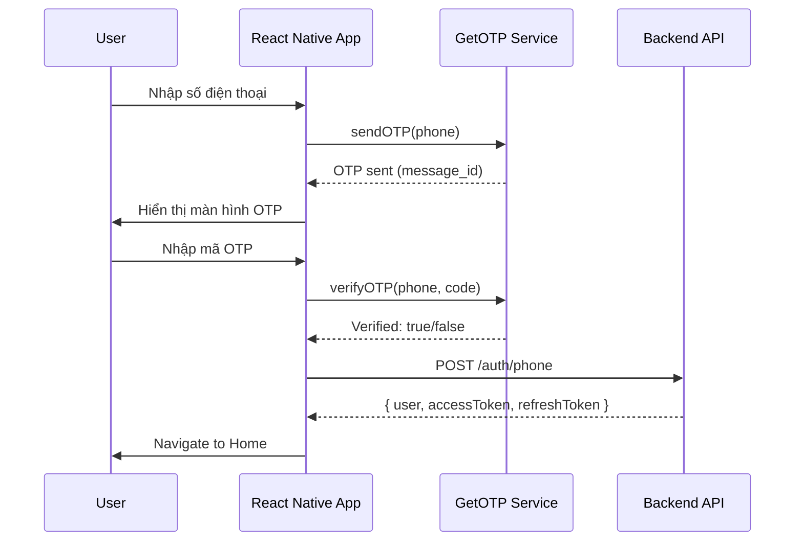
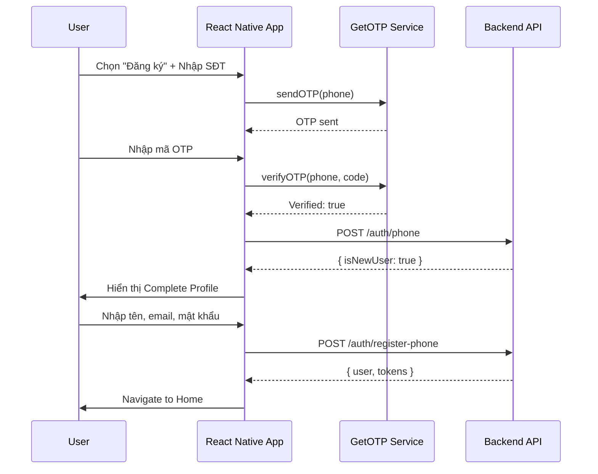
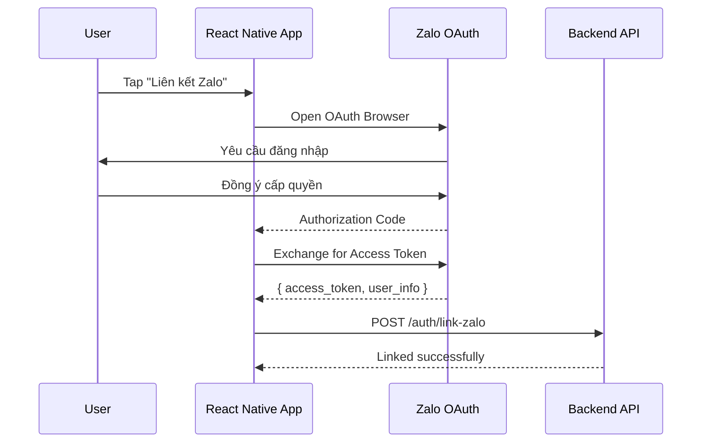

# 📱 Hướng dẫn Đăng ký/Đăng nhập bằng Zalo OTP

## 📋 Mục lục

1. [Tổng quan](#tổng-quan)
2. [Kiến trúc hệ thống](#kiến-trúc-hệ-thống)
3. [Cấu trúc file](#cấu-trúc-file)
4. [Cấu hình](#cấu-hình)
5. [Flow chi tiết](#flow-chi-tiết)
6. [API Reference](#api-reference)
7. [Troubleshooting](#troubleshooting)

---

## 🎯 Tổng quan

Hệ thống đăng ký/đăng nhập bằng Zalo OTP cho phép người dùng:
- **Đăng nhập** bằng số điện thoại + OTP
- **Đăng ký** tài khoản mới qua OTP
- **Liên kết** tài khoản Zalo (OAuth)
- **Xác thực** đa kênh: SMS, Viber, Voice Call

### Ưu điểm
- ✅ Không cần nhớ mật khẩu
- ✅ Bảo mật cao với OTP có thời hạn
- ✅ Trải nghiệm người dùng mượt mà
- ✅ Tích hợp Zalo ecosystem

---

## 🏗️ Kiến trúc hệ thống

```
┌─────────────────────────────────────────────────────────────┐
│                      USER INTERFACE                          │
├─────────────────────────────────────────────────────────────┤
│  login-phone.tsx  →  otp-verify.tsx  →  complete-profile.tsx │
└─────────────────────────────────────────────────────────────┘
                              │
                              ▼
┌─────────────────────────────────────────────────────────────┐
│                      SERVICES LAYER                          │
├─────────────────────────────────────────────────────────────┤
│  zaloOTPAuthService.ts  ←→  getOTPService.ts                 │
│         │                        │                           │
│         ▼                        ▼                           │
│  zaloAuthService.ts       GetOTP API (otp.dev)               │
└─────────────────────────────────────────────────────────────┘
                              │
                              ▼
┌─────────────────────────────────────────────────────────────┐
│                      BACKEND API                             │
├─────────────────────────────────────────────────────────────┤
│  POST /auth/phone        - Xác thực số điện thoại            │
│  POST /auth/register-phone - Đăng ký với số điện thoại       │
│  POST /auth/zalo         - Đăng nhập bằng Zalo OAuth         │
│  POST /auth/link-zalo    - Liên kết tài khoản Zalo           │
└─────────────────────────────────────────────────────────────┘
```

---

## 📁 Cấu trúc file

### Services
```
services/
├── zaloOTPAuthService.ts    # Service chính xử lý OTP flow
├── zaloAuthService.ts       # Zalo OAuth integration
├── getOTPService.ts         # GetOTP API wrapper
└── otpService.ts            # Multi-provider OTP (backup)
```

### Screens (UI)
```
app/(auth)/
├── login-phone.tsx          # Màn hình nhập số điện thoại
├── otp-verify.tsx           # Màn hình xác thực OTP
├── complete-profile.tsx     # Màn hình bổ sung thông tin
├── login-zalo.tsx           # Màn hình login style Zalo (password)
└── _layout.tsx              # Auth layout
```

### Config
```
config/
├── env.ts                   # Environment variables
└── externalApis.ts          # External API configurations

.env                         # Environment file với API keys
```

---

## ⚙️ Cấu hình

### 1. Environment Variables (.env)

```bash
# ============================================
# OTP & SMS Services Configuration
# ============================================

# GetOTP (Primary - https://otp.dev)
EXPO_PUBLIC_GETOTP_API_KEY=b2c885626ab1e17735372aa843edb431
GETOTP_API_KEY=b2c885626ab1e17735372aa843edb431
GETOTP_SENDER_NAME=ThietKe
GETOTP_DEFAULT_CHANNEL=sms
GETOTP_CODE_LENGTH=6

# ============================================
# Zalo Configuration
# ============================================

# Zalo App (https://developers.zalo.me)
ZALO_APP_ID=1408601745775286980
ZALO_APP_SECRET=ZQXD5iVxC48Eyol4DM6m
EXPO_PUBLIC_ZALO_APP_ID=1408601745775286980

# ============================================
# API Configuration  
# ============================================
EXPO_PUBLIC_API_BASE_URL=https://baotienweb.cloud/api/v1
EXPO_PUBLIC_API_KEY=thietke-resort-api-key-2024
```

### 2. GetOTP Dashboard Setup

1. Truy cập: https://otp.dev/en/dashboard/
2. Tạo tài khoản và lấy API Key
3. Cấu hình Sender Name: `ThietKe` hoặc `NhaXinh`
4. Setup Webhook URL: `https://baotienweb.cloud/api/v1/otp/webhook`

### 3. Zalo Developer Setup

1. Truy cập: https://developers.zalo.me/apps
2. Tạo app mới hoặc sử dụng app hiện có
3. Cấu hình OAuth:
   - **Redirect URI**: `exp://localhost:8081/--/zalo-callback`
   - **Domain**: `baotienweb.cloud`
4. Lấy App ID và Secret Key

---

## 🔄 Flow chi tiết

### Flow 1: Đăng nhập bằng OTP



### Flow 2: Đăng ký mới



### Flow 3: Liên kết Zalo



---

## 📚 API Reference

### ZaloOTPAuthService

#### `sendOTP(phone, options?)`

Gửi mã OTP đến số điện thoại.

```typescript
import { zaloOTPAuth } from '@/services/zaloOTPAuthService';

const result = await zaloOTPAuth.sendOTP('0912345678', {
  channel: 'sms', // 'sms' | 'viber' | 'voice'
  isResend: false
});

// Response
{
  success: true,
  message: 'Mã OTP đã được gửi đến +84 912 ***678',
  expiresIn: 300,
  remainingAttempts: 2,
  channel: 'sms'
}
```

#### `verifyOTP(phone, code)`

Xác thực mã OTP.

```typescript
const result = await zaloOTPAuth.verifyOTP('0912345678', '123456');

// Response thành công
{
  success: true,
  message: 'Đăng nhập thành công',
  user: {
    id: 'user_84912345678',
    phone: '+84912345678',
    name: 'Nguyễn Văn A',
    isNewUser: false,
    verified: true
  },
  accessToken: 'eyJhbGciOiJIUzI1NiIs...',
  refreshToken: 'refresh_...',
  isNewUser: false
}
```

#### `completeRegistration(phone, data)`

Hoàn tất đăng ký cho user mới.

```typescript
const result = await zaloOTPAuth.completeRegistration('+84912345678', {
  name: 'Nguyễn Văn A',
  email: 'email@example.com', // optional
  password: 'mypassword123',  // optional
  referralCode: 'REF123'      // optional
});
```

#### `signInWithZalo()`

Đăng nhập bằng Zalo OAuth.

```typescript
const result = await zaloOTPAuth.signInWithZalo();

// Response
{
  success: true,
  user: {
    id: 'zalo_12345',
    phone: '+84912345678',
    name: 'Nguyễn Văn A',
    avatar: 'https://...',
    zaloId: '12345',
    isNewUser: false,
    verified: true
  },
  accessToken: '...',
  refreshToken: '...'
}
```

#### `linkZaloAccount()`

Liên kết tài khoản Zalo với account hiện tại.

```typescript
const result = await zaloOTPAuth.linkZaloAccount();

// Response
{
  success: true,
  message: 'Đã liên kết tài khoản Zalo thành công',
  zaloUser: {
    id: 'zalo_12345',
    name: 'Nguyễn Văn A',
    picture: { data: { url: 'https://...' } }
  }
}
```

### Utility Functions

```typescript
import { 
  formatVietnamesePhone, 
  isValidVietnamesePhone, 
  maskPhone 
} from '@/services/zaloOTPAuthService';

// Format số điện thoại
formatVietnamesePhone('0912345678'); // '+84912345678'

// Validate số điện thoại Vietnam
isValidVietnamesePhone('0912345678'); // true
isValidVietnamesePhone('0123456789'); // false (invalid prefix)

// Mask số điện thoại để hiển thị
maskPhone('+84912345678'); // '+84 912 ***678'
```

---

## 🐛 Troubleshooting

### Lỗi phổ biến

#### 1. "API key không hợp lệ"
```
Error: GetOTPError: API key không hợp lệ hoặc không được phép (1136)
```
**Giải pháp**: Kiểm tra `EXPO_PUBLIC_GETOTP_API_KEY` trong `.env`

#### 2. "Số điện thoại không hợp lệ"
```
Error: Số điện thoại không hợp lệ. Vui lòng nhập số điện thoại Việt Nam.
```
**Giải pháp**: Số điện thoại phải bắt đầu bằng 03, 05, 07, 08, hoặc 09

#### 3. "Mã OTP đã hết hạn"
```
Error: Mã OTP đã hết hạn. Vui lòng yêu cầu mã mới.
```
**Giải pháp**: OTP có hiệu lực 5 phút, nhấn "Gửi lại mã"

#### 4. "Đăng nhập Zalo thất bại"
```
Error: Người dùng hủy đăng nhập
```
**Giải pháp**: User đã đóng popup Zalo, thử lại

### Debug Mode

Trong development, nếu GetOTP chưa hoạt động, service sẽ tự động tạo mock OTP:

```typescript
// Console log khi mock mode
[ZaloOTPAuth] Created mock user: user_84912345678
```

Để xem OTP thực:
```typescript
// Console log
[GetOTP] Response: 200 { data: { message_id: '...', phone: '+84912345678' } }
```

### Testing OTP Flow

1. **Development mode**: Sử dụng số điện thoại thật, OTP sẽ được gửi qua SMS
2. **Mock mode**: Nếu API key không hợp lệ, OTP sẽ hiển thị trong console

---

## 📊 Monitoring

### GetOTP Dashboard

- URL: https://otp.dev/en/dashboard/
- Xem lịch sử gửi OTP
- Theo dõi tỷ lệ gửi thành công
- Kiểm tra số dư tài khoản

### Backend Logs

```bash
# Xem logs OTP
tail -f /var/log/api/otp.log
```

---

## 🔐 Bảo mật

### Best Practices

1. **Rate Limiting**: Max 3 lần gửi OTP / số điện thoại / 15 phút
2. **OTP Expiry**: Mã hết hạn sau 5 phút
3. **Max Attempts**: 5 lần nhập sai → khóa tạm thời
4. **PKCE**: Zalo OAuth sử dụng PKCE để bảo vệ token exchange
5. **Secure Storage**: Token lưu trong SecureStore/Keychain

### Đừng làm

- ❌ Lưu OTP vào logs
- ❌ Hiển thị OTP trong production alerts
- ❌ Gửi OTP qua email nếu đã có SMS
- ❌ Cho phép brute force OTP

---

## 📞 Hỗ trợ

- **Email**: support@thietkeresort.com.vn
- **Hotline**: 1900-xxxx
- **Zalo OA**: https://zalo.me/1408601745775286980

---

## 🖥️ Backend Deployment (VPS baotienweb.cloud)

### Files Backend đã tạo

```
BE-baotienweb.cloud/src/zalo/
├── zalo.module.ts          # NestJS Module
├── zalo.controller.ts      # API Controller  
├── zalo.service.ts         # Main Service
├── zns.service.ts          # Zalo Notification Service
├── zalo-auth.service.ts    # Auth Service
├── dto/
│   └── zalo.dto.ts        # DTOs
└── index.ts               # Exports
```

### Deploy Commands

```bash
# SSH vào VPS
ssh root@103.200.20.100

# Hoặc chạy script deploy
cd BE-baotienweb.cloud
./deploy-zalo.sh        # Linux/Mac
.\deploy-zalo.ps1       # Windows PowerShell
```

### API Endpoints (Production)

| Method | Endpoint | Mô tả |
|--------|----------|-------|
| POST | `/v1/zalo/login` | Đăng nhập Zalo OAuth |
| POST | `/v1/zalo/send-otp` | Gửi OTP |
| POST | `/v1/zalo/verify-otp` | Xác thực OTP |
| POST | `/v1/zalo/register-phone` | Đăng ký SĐT |
| POST | `/v1/zalo/send-zns` | Gửi ZNS notification |
| GET | `/v1/zalo/templates` | Danh sách templates |
| GET | `/v1/zalo/status` | Kiểm tra config |

### Tài liệu chi tiết

📚 Xem [ZALO_VPS_DEPLOYMENT_GUIDE.md](../BE-baotienweb.cloud/ZALO_VPS_DEPLOYMENT_GUIDE.md) để biết hướng dẫn deploy đầy đủ.

---

