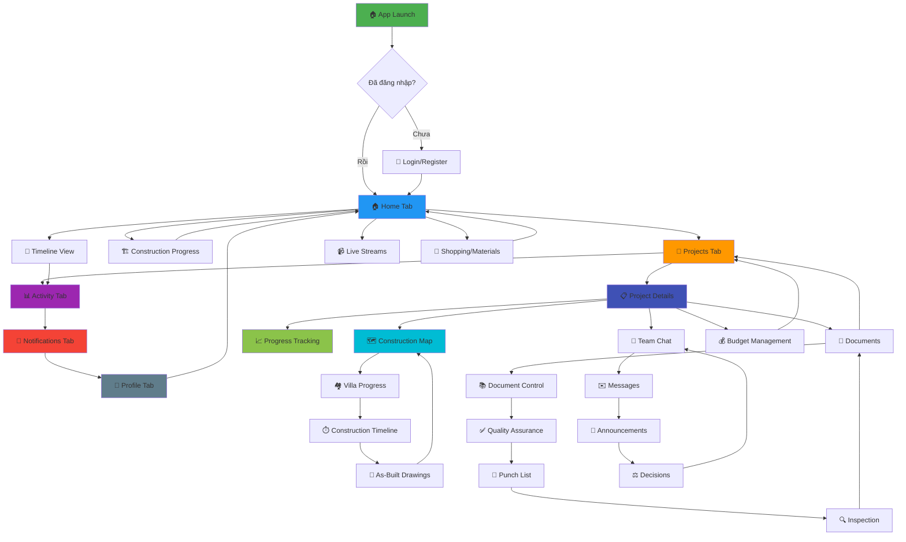

# App Architecture - Thiết Kế Xây Dựng & Quản Lý Tiến Độ

## 🎯 Tổng Quan Hệ Thống

**Tên App:** Construction Design & Project Management  
**Platform:** React Native + Expo Router (SDK 54)  
**Backend:** NestJS + PostgreSQL + WebSocket  
**Mục đích:** Quản lý dự án xây dựng, thiết kế kiến trúc, theo dõi tiến độ real-time

---

## 📊 Sơ Đồ Navigation Vòng Tròn (Circular User Flow)



---

## 🏗️ Component Architecture Hierarchy

```
┌─────────────────────────────────────────────────────────────────┐
│                         App Root (_layout.tsx)                  │
│  ┌────────────────────────────────────────────────────────────┐ │
│  │ FormErrorBoundary                                          │ │
│  │  ├─ AuthProvider (User authentication & session)          │ │
│  │  ├─ CartProvider (Shopping cart state)                    │ │
│  │  ├─ WebSocketProvider (/chat namespace)                   │ │
│  │  ├─ ProgressWebSocketProvider (/progress namespace)       │ │
│  │  ├─ UtilitiesProvider (Global utilities)                  │ │
│  │  ├─ ProjectDataProvider (Project state management)        │ │
│  │  ├─ VideoInteractionsProvider (Live stream interactions) │ │
│  │  └─ NotificationProvider (Push notifications)             │ │
│  └────────────────────────────────────────────────────────────┘ │
└─────────────────────────────────────────────────────────────────┘

┌─────────────────────────────────────────────────────────────────┐
│                        Main Navigation Tabs                      │
├─────────────────┬──────────────┬──────────────┬─────────────────┤
│  🏠 Home        │ 📁 Projects  │ 📊 Activity  │ 🔔 Notifications│
│  (index.tsx)   │ (projects)   │ (activity)   │ (notifications) │
└─────────────────┴──────────────┴──────────────┴─────────────────┘
                                                  │ 👤 Profile      │
                                                  └─────────────────┘

┌─────────────────────────────────────────────────────────────────┐
│                    Feature Modules (By Domain)                   │
├─────────────────────────────────────────────────────────────────┤
│                                                                  │
│ 🏗️ CONSTRUCTION MANAGEMENT                                      │
│  ├─ construction/map/[id].tsx (Construction Site Map)          │
│  ├─ construction/progress.tsx (Overall Progress)               │
│  ├─ construction/villa-progress.tsx (Villa-specific)           │
│  ├─ construction-progress.tsx (Aggregate View)                 │
│  └─ as-built/ (As-Built Documentation)                         │
│                                                                  │
│ 📈 PROGRESS TRACKING & ANALYTICS                                │
│  ├─ progress-tracking.tsx (Real-time Progress)                 │
│  ├─ timeline/ (Project Timeline Views)                         │
│  ├─ projects/[id]/construction-timeline.tsx                    │
│  ├─ analytics.tsx (Data Analytics Dashboard)                   │
│  └─ reports/kpi.tsx (KPI Dashboard)                            │
│                                                                  │
│ 📁 PROJECT MANAGEMENT                                           │
│  ├─ projects/[id].tsx (Project Detail - Main)                  │
│  ├─ projects/[id]-detail.tsx (Alternative Detail View)         │
│  ├─ projects/project-management.tsx (PM Dashboard)             │
│  ├─ projects/create.tsx (Create New Project)                   │
│  ├─ projects/progress-detail.tsx (Detailed Progress)           │
│  └─ projects/[id]/minimap.tsx (Project Mini Map)               │
│                                                                  │
│ 💬 COMMUNICATION & COLLABORATION                                │
│  ├─ messages/ (Direct Messaging)                               │
│  │  ├─ index.tsx (Message List)                               │
│  │  ├─ [userId].tsx (Message Thread)                          │
│  │  └─ chat/[id].tsx (Group Chat)                             │
│  ├─ projects/[id]/chat.tsx (Team Chat)                         │
│  ├─ projects/[id]/announcements/ (Project Announcements)       │
│  └─ projects/[id]/decisions/ (Decision Tracking)               │
│                                                                  │
│ 📄 DOCUMENT MANAGEMENT                                          │
│  ├─ documents/ (Document Control System)                       │
│  │  ├─ create-folder.tsx                                      │
│  │  └─ versions.tsx (Version Control)                         │
│  ├─ document-control/ (DMS)                                    │
│  └─ projects/library.tsx (Project Library)                     │
│                                                                  │
│ ✅ QUALITY & SAFETY                                             │
│  ├─ quality-assurance/ (QA System)                             │
│  ├─ punch-list/ (Punch List Management)                        │
│  │  ├─ index.tsx (List View)                                  │
│  │  └─ [id].tsx (Punch Item Detail)                           │
│  ├─ inspection/ (Inspection Reports)                           │
│  ├─ safety/ (Safety Management)                                │
│  │  ├─ incidents/ (Incident Tracking)                         │
│  │  └─ ppe/ (PPE Inventory & Distribution)                    │
│  └─ commissioning/ (Commissioning Process)                     │
│                                                                  │
│ 💰 BUDGET & PROCUREMENT                                         │
│  ├─ budget/ (Budget Management)                                │
│  ├─ procurement/ (Procurement System)                          │
│  │  └─ [id].tsx (Purchase Order Detail)                       │
│  ├─ contracts/ (Contract Management)                           │
│  ├─ projects/quotation-list.tsx (Quotations)                   │
│  └─ quote-request.tsx (RFQ)                                    │
│                                                                  │
│ 🛠️ RESOURCES & MATERIALS                                        │
│  ├─ materials/ (Material Management)                           │
│  ├─ inventory/ (Inventory System)                              │
│  │  ├─ index.tsx (Dashboard)                                  │
│  │  └─ materials.tsx (Material Inventory)                     │
│  ├─ equipment/ (Equipment Tracking)                            │
│  ├─ projects/[id]/materials/ (Project Materials)               │
│  └─ resource-planning/resources.tsx (Resource Planning)        │
│                                                                  │
│ 🎨 DESIGN & ARCHITECTURE                                        │
│  ├─ projects/architecture-portfolio.tsx (Architecture)         │
│  ├─ projects/design-portfolio.tsx (Design)                     │
│  ├─ projects/construction-portfolio.tsx (Construction)         │
│  └─ projects/architecture/[id].tsx (Architecture Detail)       │
│                                                                  │
│ 👷 WORKFORCE MANAGEMENT                                         │
│  ├─ labor/ (Labor Management)                                  │
│  ├─ daily-report/ (Daily Reports)                              │
│  ├─ scheduled-tasks.tsx (Task Scheduling)                      │
│  └─ projects/find-contractors.tsx (Contractor Directory)       │
│                                                                  │
│ 📹 LIVE & MEDIA                                                 │
│  ├─ live/ (Live Streaming)                                     │
│  ├─ (tabs)/live.tsx (Live Streams Tab)                         │
│  ├─ projects/[id]/photos.tsx (Project Photos)                  │
│  ├─ videos/ (Video Library)                                    │
│  └─ stories/ (Stories Feature)                                 │
│                                                                  │
│ 🛒 E-COMMERCE & SHOPPING                                        │
│  ├─ shopping/ (Product Catalog)                                │
│  ├─ cart.tsx (Shopping Cart)                                   │
│  ├─ checkout.tsx (Checkout Flow)                               │
│  ├─ product/[id].tsx (Product Detail)                          │
│  └─ seller/dashboard.tsx (Seller Dashboard)                    │
│                                                                  │
│ ⚙️ SYSTEM & UTILITIES                                           │
│  ├─ utilities/ (Utility Functions)                             │
│  ├─ health-check.tsx (System Health)                           │
│  ├─ analytics.tsx (Analytics Dashboard)                        │
│  ├─ admin/ (Admin Panel)                                       │
│  └─ demo/ (Demo/Test Screens)                                  │
│                                                                  │
│ 🌦️ EXTERNAL INTEGRATIONS                                       │
│  ├─ weather/ (Weather Integration)                             │
│  ├─ environmental/ (Environmental Monitoring)                  │
│  ├─ fleet/ (Fleet Management)                                  │
│  └─ legal/ (Legal Documents)                                   │
│                                                                  │
└─────────────────────────────────────────────────────────────────┘
```

---

## 🔄 Data Flow Architecture

```
┌─────────────────────────────────────────────────────────────────┐
│                        Client (Mobile App)                       │
├─────────────────────────────────────────────────────────────────┤
│                                                                  │
│  UI Components (Screens)                                        │
│       ↓↑                                                         │
│  React Contexts (State Management)                              │
│   ├─ AuthContext                                                │
│   ├─ CartContext                                                │
│   ├─ WebSocketContext (/chat)                                   │
│   ├─ ProgressWebSocketContext (/progress)                       │
│   ├─ ProjectDataContext                                         │
│   └─ NotificationContext                                        │
│       ↓↑                                                         │
│  Service Layer                                                   │
│   ├─ apiClient.ts (REST API wrapper)                           │
│   ├─ socket.ts (WebSocket /chat)                               │
│   ├─ progressSocket.ts (WebSocket /progress)                   │
│   ├─ progressTracking.ts (Progress services)                   │
│   ├─ healthCheck.ts (Health monitoring)                        │
│   └─ api.ts (Generic API utilities)                            │
│       ↓↑                                                         │
│  Network Layer                                                   │
│   ├─ HTTPS REST API                                            │
│   ├─ WebSocket (wss://)                                        │
│   └─ File Upload/Download                                      │
│                                                                  │
└─────────────────────────────────────────────────────────────────┘
                              ↓↑
┌─────────────────────────────────────────────────────────────────┐
│                   Backend (NestJS API Server)                    │
├─────────────────────────────────────────────────────────────────┤
│                                                                  │
│  WebSocket Gateways                                             │
│   ├─ ChatGateway (/chat namespace)                             │
│   └─ ProgressGateway (/progress namespace)                     │
│       ↓↑                                                         │
│  REST API Controllers                                            │
│   ├─ AuthController                                             │
│   ├─ ProjectsController                                         │
│   ├─ TasksController                                            │
│   ├─ CommentsController                                         │
│   ├─ UploadController                                           │
│   └─ HealthController                                           │
│       ↓↑                                                         │
│  Service Layer                                                   │
│   ├─ ProjectsService (getProgress, update)                     │
│   ├─ TasksService (getProgress, update)                        │
│   ├─ ProgressGateway (emitTaskProgress, emitProjectProgress)   │
│   ├─ AuthService                                                │
│   └─ EmailService                                               │
│       ↓↑                                                         │
│  Database Layer (Prisma ORM)                                    │
│   ├─ Project model                                              │
│   ├─ Task model                                                 │
│   ├─ User model                                                 │
│   ├─ Comment model                                              │
│   ├─ File model                                                 │
│   └─ ChatMessage model                                          │
│       ↓↑                                                         │
│  PostgreSQL Database                                             │
│                                                                  │
└─────────────────────────────────────────────────────────────────┘
```

---

## 🎨 UX/UI Design Patterns

### 1. **Navigation Pattern: Bottom Tabs + Stack**
```
├─ (tabs)/ - Bottom Tab Navigator (4 visible tabs)
│  ├─ index.tsx (Home) ✅ Visible
│  ├─ projects.tsx (Projects) ✅ Visible
│  ├─ activity.tsx (Activity) ✅ Visible
│  ├─ notifications.tsx (Notifications) ✅ Visible
│  ├─ profile.tsx (Profile - Hidden, via menu)
│  ├─ menu.tsx (Menu - Hidden utility)
│  └─ menu9.tsx (Messages - Hidden, via notifications)
│
└─ Feature Screens - Stack Navigation (Push/Pop)
   ├─ projects/[id].tsx
   ├─ messages/[userId].tsx
   └─ construction/map/[id].tsx
```

### 2. **Real-time Update Pattern**
```typescript
// Pattern: WebSocket Subscription in Components
useEffect(() => {
  const unsubscribe = progressSocket.subscribeToProject(
    projectId,
    (data) => {
      setProgress(data.progress);
      showToast('Progress updated!');
    }
  );
  
  return unsubscribe; // Cleanup on unmount
}, [projectId]);
```

### 3. **Lazy Loading Pattern**
```typescript
// Heavy screens loaded on-demand
const ConstructionMap = lazy(() => import('./construction/map/[id]'));
const ProgressTracking = lazy(() => import('./progress-tracking'));
```

### 4. **Offline-First Pattern**
```typescript
// Cache data locally, sync when online
- AsyncStorage for persistent cache
- React Query for server state management
- Optimistic UI updates
```

---

## 📱 Screen Inventory (100+ Screens)

### Core Tabs (4 Main + 1 Hidden)
1. ✅ **Home** - `app/(tabs)/index.tsx`
2. ✅ **Projects** - `app/(tabs)/projects.tsx`
3. ✅ **Activity** - `app/(tabs)/activity.tsx`
4. ✅ **Notifications** - `app/(tabs)/notifications.tsx`
5. ⚙️ **Profile** - `app/(tabs)/profile.tsx` (Hidden - via menu)

### Authentication (3 screens)
6. 🔐 Login - `app/(auth)/login.tsx`
7. 📝 Register - `app/(auth)/register.tsx`
8. 🔑 Forgot Password - `app/(auth)/forgot-password.tsx`

### Construction Management (15+ screens)
9. 🏗️ Construction Progress - `app/construction-progress.tsx`
10. 🗺️ Construction Map Detail - `app/construction/map/[id].tsx`
11. 🏘️ Villa Progress - `app/construction/villa-progress.tsx`
12. ⏱️ Construction Timeline - `app/projects/[id]/construction-timeline.tsx`
13. 📐 As-Built Drawings - `app/as-built/`
14. 📅 Scheduled Tasks - `app/scheduled-tasks.tsx`
15. 🏗️ Construction Booking - `app/construction/booking.tsx`

### Project Management (20+ screens)
16. 📋 Project Detail - `app/projects/[id].tsx`
17. 📋 Project Detail (Alt) - `app/projects/[id]-detail.tsx`
18. ➕ Create Project - `app/projects/create.tsx`
19. 📊 Project Management - `app/projects/project-management.tsx`
20. 📈 Progress Detail - `app/projects/progress-detail.tsx`
21. 🗺️ Project Minimap - `app/projects/[id]/minimap.tsx`
22. 📄 Project Library - `app/projects/library.tsx`
23. 💰 Quotation List - `app/projects/quotation-list.tsx`
24. 👷 Find Contractors - `app/projects/find-contractors.tsx`
25. 📸 Project Photos - `app/projects/[id]/photos.tsx`

### Progress Tracking & Analytics (8 screens)
26. 📈 Progress Tracking - `app/progress-tracking.tsx`
27. 📅 Timeline View - `app/timeline/index.tsx`
28. 📊 Analytics Dashboard - `app/analytics.tsx`
29. 📊 KPI Dashboard - `app/reports/kpi.tsx`
30. 🩺 Health Check - `app/health-check.tsx`

### Communication (10+ screens)
31. ✉️ Messages List - `app/messages/index.tsx`
32. 💬 Message Thread - `app/messages/[userId].tsx`
33. 👥 Group Chat - `app/messages/chat/[id].tsx`
34. 💬 Team Chat - `app/projects/[id]/chat.tsx`
35. 📢 Announcements - `app/projects/[id]/announcements.tsx`
36. 📢 Announcement Detail - `app/projects/[id]/announcements/[announcementId].tsx`
37. ⚖️ Decisions - `app/projects/[id]/decisions/[decisionId].tsx`

### Documents (6 screens)
38. 📄 Documents - `app/documents/`
39. 📁 Create Folder - `app/documents/create-folder.tsx`
40. 🔄 Document Versions - `app/documents/versions.tsx`
41. 📚 Document Control - `app/document-control/`
42. 📤 File Upload - `app/file-upload.tsx`

### Quality & Safety (12 screens)
43. ✅ Quality Assurance - `app/quality-assurance/`
44. 📝 Punch List - `app/punch-list/index.tsx`
45. 📝 Punch Item Detail - `app/punch-list/[id].tsx`
46. 🔍 Inspection - `app/inspection/`
47. 🦺 Safety Management - `app/safety/`
48. ⚠️ Safety Incidents - `app/safety/incidents/`
49. 🦺 PPE Inventory - `app/safety/ppe/`
50. 🦺 PPE Distributions - `app/safety/ppe/distributions.migrated.tsx`
51. ✅ Commissioning - `app/commissioning/`

### Budget & Procurement (8 screens)
52. 💰 Budget Management - `app/budget/`
53. 🛒 Procurement - `app/procurement/`
54. 📄 Purchase Order Detail - `app/procurement/[id].tsx`
55. 📋 Contracts - `app/contracts/`
56. 💵 Quote Request - `app/quote-request.tsx`

### Resources & Materials (10 screens)
57. 🧱 Materials - `app/materials/`
58. 📦 Inventory Dashboard - `app/inventory/index.tsx`
59. 📦 Material Inventory - `app/inventory/materials.tsx`
60. 🚜 Equipment - `app/equipment/`
61. 🗂️ Project Materials - `app/projects/[id]/materials/`
62. 📊 Resource Planning - `app/resource-planning/resources.tsx`

### Design & Architecture (5 screens)
63. 🏛️ Architecture Portfolio - `app/projects/architecture-portfolio.tsx`
64. 🎨 Design Portfolio - `app/projects/design-portfolio.tsx`
65. 🏗️ Construction Portfolio - `app/projects/construction-portfolio.tsx`
66. 🏛️ Architecture Detail - `app/projects/architecture/[id].tsx`

### Workforce (5 screens)
67. 👷 Labor Management - `app/labor/`
68. 📝 Daily Reports - `app/daily-report/`
69. 📋 Work Detail - `app/projects/work-detail.tsx`

### Live & Media (6 screens)
70. 📹 Live Streams - `app/(tabs)/live.tsx`
71. 📹 Live Details - `app/live/`
72. 📸 Stories - `app/stories/`
73. 🎥 Videos - `app/videos/`

### E-Commerce (6 screens)
74. 🛒 Shopping - `app/shopping/`
75. 🛒 Cart - `app/cart.tsx`
76. 💳 Checkout - `app/checkout.tsx`
77. 📦 Product Detail - `app/product/[id].tsx`
78. 🏪 Seller Dashboard - `app/seller/dashboard.tsx`

### Additional Features (10+ screens)
79. 🔄 Change Management - `app/change-management/`
80. 📋 Change Orders - `app/change-order/`
81. 📋 Change Order Detail - `app/change-order/[id].tsx`
82. 🌦️ Weather - `app/weather/`
83. 🌱 Environmental - `app/environmental/`
84. 🚗 Fleet - `app/fleet/`
85. ⚖️ Legal - `app/legal/`
86. 🔧 Utilities - `app/utilities/`
87. 👨‍💼 Admin - `app/admin/`
88. 🧪 Demo - `app/demo/`

---

## 🔌 WebSocket Real-time Features

### Chat Namespace (`wss://baotienweb.cloud/chat`)
```typescript
Events:
- message:new → New chat message
- message:read → Message read status
- typing:start → User typing indicator
- typing:stop → Stop typing
- user:online → User online status
- user:offline → User offline
```

### Progress Namespace (`wss://baotienweb.cloud/progress`)
```typescript
Events:
- subscribe:task → Subscribe to task progress
- subscribe:project → Subscribe to project progress
- unsubscribe:task → Unsubscribe from task
- unsubscribe:project → Unsubscribe from project

Emitted Events:
- task:progress:<taskId> → Task progress update
  { taskId, progress, status, activityCount }
  
- project:progress:<projectId> → Project progress update
  { projectId, overallProgress, completedTasks, budget, timeline }
```

---

## 🎯 Key Design Principles

### 1. **Thẩm Mỹ (Aesthetics)**
- ✨ Modern UI với gradient backgrounds
- 🎨 Consistent color scheme (Blue, Orange, Purple, Green)
- 🌓 Dark/Light theme support (planned)
- 📱 Responsive layouts for all screen sizes
- 🖼️ High-quality images và smooth animations

### 2. **Tính Thực Dụng (Practicality)**
- ⚡ Offline-first architecture
- 📡 Real-time updates via WebSocket
- 🔄 Optimistic UI updates
- 💾 Local caching for faster load
- 🔒 Secure authentication (JWT + Refresh tokens)

### 3. **UX Excellence**
- 🎯 Clear navigation hierarchy
- 🔍 Search functionality across modules
- 📲 Push notifications for important events
- ♿ Accessibility support
- 🌐 Multi-language ready (i18n structure in place)

### 4. **Performance**
- ⚡ Lazy loading for heavy components
- 🗜️ Image optimization
- 📦 Code splitting by routes
- 🚀 React Native performance optimizations
- 📊 Performance monitoring (analytics.ts)

---

## 🛠️ Component Reusability

### UI Atoms (components/ui/)
- `Button` - Customizable button with loading states
- `Input` - Form input with validation
- `Container` - Layout wrapper
- `Section` - Content section with spacing
- `MenuCard` - Reusable menu item card
- `ProductCard` - E-commerce product card
- `InfoBox` - Information display box
- `Loader` - Loading spinner
- `OfflineIndicator` - Network status indicator

### Complex Components (components/)
- `WebSocketStatus` - WebSocket connection indicator
- `FormErrorBoundary` - Error boundary for forms
- `StatusBadge` - Status badge component

### Hooks (hooks/)
- `useApiAuth` - Authentication hook
- `useThemeColor` - Theme color hook
- `useAnalytics` - Analytics tracking
- `useCachedResources` - Resource caching
- `useRealtimeLocation` - Location tracking
- `useTimelineWebSocket` - Timeline WebSocket hook

---

## 🔐 Security Architecture

```
Authentication Flow:
1. User Login → JWT Access Token (15min) + Refresh Token (7 days)
2. Store tokens in SecureStore (encrypted)
3. Auto-refresh on 401 response
4. Logout → Clear tokens + disconnect WebSocket

Authorization:
- Role-based: CLIENT, ENGINEER, ADMIN
- Route guards in components
- API endpoint protection via JWT middleware
```

---

## 📊 Data Models (Key Entities)

```typescript
User {
  id, email, name, role
  refreshToken, twoFactorEnabled
  projects (as client/engineer)
}

Project {
  id, title, description, status
  budget, startDate, endDate
  client, engineer, tasks
  images, files, comments
}

Task {
  id, title, description, status
  priority, dueDate
  project, assignee
  comments, files
}

ChatMessage {
  id, content, type (text/image/file)
  projectId, userId, createdAt
}

Document {
  id, name, fileUrl, version
  projectId, uploadedBy
}
```

---

## 🚀 Deployment Flow

```
Development:
npm start → Expo Dev Server → Test on device/emulator

Production Build:
npm run build (backend) → Deploy to VPS (103.200.20.100)
eas build --platform android → APK for Google Play
eas build --platform ios → IPA for App Store

Backend Deployment:
1. npm run build (TypeScript → JavaScript)
2. Upload dist/ + prisma/ + package.json to VPS
3. pm2 restart baotienweb-api
4. Verify health check: https://baotienweb.cloud/api/health
```

---

## 📈 Future Enhancements

1. **AI Features**
   - AI-powered progress predictions
   - Automated risk analysis
   - Smart scheduling recommendations

2. **Mobile Features**
   - Offline mode improvements
   - Biometric authentication
   - Voice commands for reports

3. **Collaboration**
   - Video conferencing integration
   - Whiteboard collaboration
   - AR for on-site visualization

4. **Analytics**
   - Advanced reporting dashboard
   - Custom report builder
   - Export to PDF/Excel

---

## 🎓 Developer Guidelines

### Adding New Screen
```typescript
// 1. Create file: app/feature/screen-name.tsx
export default function ScreenNameScreen() {
  return (
    <Container>
      <Section title="Screen Title">
        {/* Content */}
      </Section>
    </Container>
  );
}

// 2. Add navigation in parent screen
<Button onPress={() => router.push('/feature/screen-name')}>
  Go to Screen
</Button>

// 3. Add to sitemap documentation
```

### Adding WebSocket Feature
```typescript
// 1. Use existing WebSocketContext
const { socket, connected } = useWebSocket();

// 2. Or use ProgressWebSocketContext
const { subscribeToProject } = useProgressWebSocket();

// 3. Subscribe in useEffect
useEffect(() => {
  if (!connected) return;
  const unsubscribe = subscribeToProject(id, handleUpdate);
  return unsubscribe;
}, [connected, id]);
```

---

## 📞 Support & Documentation

- **API Docs**: https://baotienweb.cloud/api/docs (Swagger)
- **Backend Health**: https://baotienweb.cloud/api/health
- **WebSocket Test**: See `WEBSOCKET_FIX_GUIDE.md`
- **Mobile Setup**: See `EXPO_SETUP_GUIDE.md`
- **Deployment**: See `DEPLOYMENT_PRODUCTION.md`

---

**Last Updated:** December 18, 2025  
**Version:** 1.0.0  
**Maintainers:** Development Team
