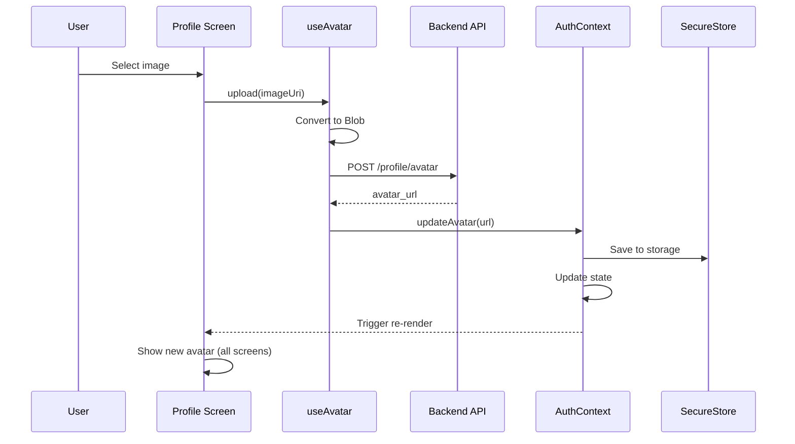

# Tài liệu Đồng bộ Hóa Profile & Avatar

**Ngày tạo**: December 12, 2025  
**Trạng thái**: 🔄 Cần hoàn thiện upload avatar

## 📋 Vấn đề Hiện tại

### ❌ Không đồng bộ
1. **Avatar không nhất quán** giữa các trang:
   - Trang chủ (`index.tsx`): Dùng `user.avatar` trực tiếp
   - Profile luxury: Dùng `resolveAvatar()` với placeholder
   - Profile info: Có upload nhưng chưa sync với backend

2. **Upload avatar chưa hoạt động**:
   - Component có UI upload (`info-luxury.tsx`)
   - Chưa có API endpoint `/profile/avatar/upload`
   - Local state không sync với global AuthContext

3. **Profile data phân mảnh**:
   - `useAuth()` → user data từ login
   - `useProfile()` → profile từ API `/profile`
   - Không có single source of truth

---

## 🎯 Giải pháp Đồng bộ

### 1. Upload Avatar API

**Backend cần thêm endpoint**:
```typescript
// POST /api/v1/profile/avatar
// multipart/form-data
{
  avatar: File
}

// Response
{
  success: true,
  data: {
    avatar_url: "/uploads/avatars/user_123_1702345678.jpg"
  }
}
```

**Frontend service** (`services/api/profileApi.ts`):
```typescript
export async function uploadAvatar(file: File | Blob): Promise<string> {
  const formData = new FormData();
  formData.append('avatar', file);

  const response = await apiFetch('/profile/avatar', {
    method: 'POST',
    body: formData,
    // Note: không set Content-Type, browser tự set với boundary
  });

  return response.data.avatar_url;
}
```

### 2. Update AuthContext

**Thêm method `updateAvatar`**:
```typescript
// context/AuthContext.tsx
interface AuthContextType {
  // ...existing
  updateAvatar: (avatarUrl: string) => Promise<void>;
  updateProfile: (data: Partial<User>) => Promise<void>;
}

// Implementation
const updateAvatar = async (avatarUrl: string) => {
  setState(prev => ({
    ...prev,
    user: prev.user ? { ...prev.user, avatar: avatarUrl } : null,
  }));
  
  // Persist to storage
  await setItem('user', JSON.stringify({ ...state.user, avatar: avatarUrl }));
};

const updateProfile = async (data: Partial<User>) => {
  if (!state.user) return;
  
  const updated = { ...state.user, ...data };
  setState(prev => ({ ...prev, user: updated }));
  await setItem('user', JSON.stringify(updated));
};
```

### 3. Unified Avatar Component

**Tạo `hooks/useAvatar.ts`**:
```typescript
import { useAuth } from '@/context/AuthContext';
import { resolveAvatar } from '@/utils/avatar';
import { useState } from 'react';

export function useAvatar() {
  const { user, updateAvatar } = useAuth();
  const [uploading, setUploading] = useState(false);

  const avatarUrl = resolveAvatar(user?.avatar, {
    userId: user?.id,
    nameFallback: user?.name,
    size: 120,
    cacheBust: Date.now(), // Force refresh after upload
  });

  const upload = async (uri: string) => {
    setUploading(true);
    try {
      // Convert to blob
      const response = await fetch(uri);
      const blob = await response.blob();

      // Upload to backend
      const { uploadAvatar } = await import('@/services/api/profileApi');
      const newAvatarUrl = await uploadAvatar(blob);

      // Update global state
      await updateAvatar(newAvatarUrl);

      return newAvatarUrl;
    } finally {
      setUploading(false);
    }
  };

  return { avatarUrl, upload, uploading };
}
```

### 4. Update All Screens

**Trang chủ** (`app/(tabs)/index.tsx`):
```typescript
import { useAvatar } from '@/hooks/useAvatar';

export default function HomeScreen() {
  const { user } = useAuth();
  const { avatarUrl } = useAvatar();

  return (
    <Image 
      source={{ uri: avatarUrl }}
      style={styles.avatar}
    />
  );
}
```

**Profile Luxury** (`app/(tabs)/profile-luxury.tsx`):
```typescript
import { useAvatar } from '@/hooks/useAvatar';

export default function ProfileLuxuryScreen() {
  const { user } = useAuth();
  const { avatarUrl } = useAvatar();

  return (
    <Image source={{ uri: avatarUrl }} style={styles.avatar} />
  );
}
```

**Profile Info** (`app/profile/info-luxury.tsx`):
```typescript
import { useAvatar } from '@/hooks/useAvatar';
import * as ImagePicker from 'expo-image-picker';

export default function ProfileInfoScreen() {
  const { avatarUrl, upload, uploading } = useAvatar();
  const [localAvatar, setLocalAvatar] = useState(avatarUrl);

  const pickImage = async () => {
    const result = await ImagePicker.launchImageLibraryAsync({
      mediaTypes: ImagePicker.MediaTypeOptions.Images,
      allowsEditing: true,
      aspect: [1, 1],
      quality: 0.8,
    });

    if (!result.canceled) {
      const uri = result.assets[0].uri;
      setLocalAvatar(uri); // Optimistic UI
      
      try {
        await upload(uri); // Sync to backend & global state
      } catch (error) {
        setLocalAvatar(avatarUrl); // Rollback on error
        alert('Upload failed');
      }
    }
  };

  return (
    <TouchableOpacity onPress={pickImage}>
      <LuxuryAvatar
        source={{ uri: localAvatar }}
        size={120}
      />
      {uploading && <Loader size="small" />}
    </TouchableOpacity>
  );
}
```

---

## 📦 Backend Requirements

### Endpoint cần thêm

```typescript
// 1. Upload Avatar
POST /api/v1/profile/avatar
Content-Type: multipart/form-data
Authorization: Bearer <token>

Body: { avatar: File }

Response: {
  success: true,
  data: {
    avatar_url: "/uploads/avatars/user_123_timestamp.jpg",
    full_url: "https://baotienweb.cloud/uploads/avatars/user_123_timestamp.jpg"
  }
}

// 2. Update Profile
PATCH /api/v1/profile
Content-Type: application/json
Authorization: Bearer <token>

Body: {
  name?: string,
  phone?: string,
  avatar?: string, // URL from upload
  bio?: string,
  address?: string
}

Response: {
  success: true,
  data: { ...updatedUser }
}

// 3. Get Profile (đã có)
GET /api/v1/profile
Authorization: Bearer <token>

Response: {
  success: true,
  data: {
    id: 123,
    email: "user@example.com",
    name: "User Name",
    avatar: "/uploads/avatars/user_123.jpg",
    phone: "0123456789",
    role: "CLIENT"
  }
}
```

### File Storage

**Thư mục**: `/public/uploads/avatars/`

**Naming**: `user_{userId}_{timestamp}.{ext}`

**Validation**:
- Max size: 5MB
- Allowed types: jpg, jpeg, png, webp
- Auto resize: 512x512px
- Generate thumbnail: 120x120px

---

## 🔄 Flow Đồng bộ



---

## ✅ Checklist Hoàn thiện

### Frontend
- [ ] Tạo `hooks/useAvatar.ts` - Single source for avatar
- [ ] Tạo `services/api/profileApi.ts` - Upload & update API
- [ ] Update `context/AuthContext.tsx` - Add updateAvatar & updateProfile
- [ ] Update `app/(tabs)/index.tsx` - Use useAvatar hook
- [ ] Update `app/(tabs)/profile-luxury.tsx` - Use useAvatar hook
- [ ] Update `app/profile/info-luxury.tsx` - Connect upload to backend
- [ ] Update `app/(tabs)/profile.tsx` - Use useAvatar hook
- [ ] Test upload → refresh → verify consistency

### Backend
- [ ] Create `POST /api/v1/profile/avatar` endpoint
- [ ] Create `PATCH /api/v1/profile` endpoint
- [ ] Setup file storage `/uploads/avatars/`
- [ ] Add image validation & resize
- [ ] Update `GET /api/v1/profile` to include avatar URL
- [ ] Add CORS headers for image URLs
- [ ] Test upload from mobile app

### Documentation
- [x] Document current issues
- [x] Design solution architecture
- [x] Create API specs
- [ ] Update API_INTEGRATION.md
- [ ] Add upload examples to BACKEND_INTEGRATION_GUIDE.md

---

## 🚀 Implementation Steps

### Step 1: Backend (Ưu tiên)
```bash
# 1. Tạo migration cho users.avatar column
# 2. Tạo ProfileController.uploadAvatar()
# 3. Tạo ProfileController.updateProfile()
# 4. Setup multer/sharp cho image processing
# 5. Test với Postman
```

### Step 2: Frontend Services
```bash
# 1. Tạo services/api/profileApi.ts
# 2. Tạo hooks/useAvatar.ts
# 3. Test upload flow với mock backend
```

### Step 3: Update UI
```bash
# 1. Update AuthContext với updateAvatar
# 2. Replace avatar usage trong index.tsx
# 3. Replace avatar usage trong profile-luxury.tsx
# 4. Connect upload button trong info-luxury.tsx
# 5. Test end-to-end
```

### Step 4: Testing
```bash
# 1. Upload avatar từ profile screen
# 2. Verify hiển thị đúng trong home screen
# 3. Verify hiển thị đúng trong profile screens
# 4. Test offline/online sync
# 5. Test cache busting
```

---

## 📝 Example Usage

### After Implementation

```typescript
// Any screen can use avatar consistently
import { useAvatar } from '@/hooks/useAvatar';

function MyScreen() {
  const { avatarUrl, upload, uploading } = useAvatar();

  return (
    <>
      <Image source={{ uri: avatarUrl }} style={styles.avatar} />
      {uploading && <Loader />}
    </>
  );
}
```

### Upload Flow

```typescript
import { useAvatar } from '@/hooks/useAvatar';
import * as ImagePicker from 'expo-image-picker';

function ProfileEdit() {
  const { upload } = useAvatar();

  const handleUpload = async () => {
    const result = await ImagePicker.launchImageLibraryAsync({
      mediaTypes: ImagePicker.MediaTypeOptions.Images,
      allowsEditing: true,
      aspect: [1, 1],
      quality: 0.8,
    });

    if (!result.canceled) {
      await upload(result.assets[0].uri);
      // Auto-synced to all screens via AuthContext
    }
  };

  return <Button onPress={handleUpload}>Upload Avatar</Button>;
}
```

---

## 🔗 Related Files

**Frontend**:
- `context/AuthContext.tsx` - Global user state
- `hooks/useProfile.ts` - Profile API hook
- `utils/avatar.ts` - Avatar URL resolution
- `services/api.ts` - API client
- `app/(tabs)/index.tsx` - Home screen avatar
- `app/(tabs)/profile-luxury.tsx` - Profile avatar
- `app/profile/info-luxury.tsx` - Avatar upload UI

**Backend** (cần tạo):
- `controllers/ProfileController.ts` - Upload & update
- `routes/profile.ts` - Profile routes
- `middleware/upload.ts` - Multer config
- `migrations/add_avatar_column.sql` - DB schema

---

## 💡 Best Practices

1. **Always use `useAvatar()` hook** - Don't access `user.avatar` directly
2. **Use `resolveAvatar()` utility** - Handles all URL formats + fallbacks
3. **Cache busting after upload** - Add `?t=timestamp` to force refresh
4. **Optimistic UI** - Show local image immediately, rollback on error
5. **Error handling** - Show user-friendly message on upload failure
6. **Image optimization** - Resize to 512x512 before upload
7. **Secure storage** - Save avatar URL in SecureStore with user data

---

## 📊 Current Status

| Component | Avatar Source | Status |
|-----------|---------------|--------|
| Home Screen | `user.avatar` directly | ❌ Không dùng resolveAvatar |
| Profile Luxury | `resolveAvatar()` | ⚠️ Placeholder only |
| Profile Info | Local state + upload UI | ❌ Upload không hoạt động |
| AuthContext | Login response | ✅ OK |
| useProfile hook | `/profile` API | ⚠️ Không merge vào AuthContext |

**Cần làm**: Thống nhất tất cả dùng `useAvatar()` hook + backend upload API
