# Visual Sitemap - App Navigation Structure

## 🗺️ Complete Sitemap với Circular Navigation Flow

```mermaid
graph LR
    subgraph APP_ROOT[" 🏗️ Construction Design & Management App "]
        
        subgraph AUTH["🔐 AUTHENTICATION"]
            A1[Login]
            A2[Register]
            A3[Forgot Password]
        end
        
        subgraph MAIN_TABS["📱 MAIN TABS (Bottom Navigation)"]
            T1[🏠 Home]
            T2[📁 Projects]
            T3[📊 Activity]
            T4[🔔 Notifications]
            T5[👤 Profile]
        end
        
        subgraph HOME_FEATURES["🏠 HOME QUICK ACCESS"]
            H1[🏗️ Construction Progress]
            H2[📅 Timeline View]
            H3[📹 Live Streams]
            H4[🛒 Shopping/Materials]
            H5[📊 Analytics]
            H6[🩺 Health Check]
        end
        
        subgraph PROJECT_DEEP["📁 PROJECT MANAGEMENT"]
            P1[📋 Project Detail]
            P2[➕ Create Project]
            P3[📊 Project Management Dashboard]
            P4[📈 Progress Detail]
            P5[🗺️ Project Minimap]
            P6[💰 Quotation List]
            P7[👷 Find Contractors]
            P8[📄 Project Library]
        end
        
        subgraph CONSTRUCTION["🏗️ CONSTRUCTION & PROGRESS"]
            C1[🗺️ Construction Site Map]
            C2[🏘️ Villa Progress]
            C3[⏱️ Construction Timeline]
            C4[📐 As-Built Drawings]
            C5[📅 Scheduled Tasks]
            C6[🏗️ Construction Booking]
            C7[📈 Progress Tracking Real-time]
        end
        
        subgraph COMMUNICATION["💬 COMMUNICATION"]
            CM1[✉️ Messages List]
            CM2[💬 Message Thread]
            CM3[👥 Group Chat]
            CM4[💬 Team Project Chat]
            CM5[📢 Announcements]
            CM6[⚖️ Decision Tracking]
        end
        
        subgraph DOCUMENTS["📄 DOCUMENTS & CONTROL"]
            D1[📚 Document Management]
            D2[📁 Create Folder]
            D3[🔄 Version Control]
            D4[📤 File Upload]
        end
        
        subgraph QUALITY["✅ QUALITY & SAFETY"]
            Q1[✅ Quality Assurance]
            Q2[📝 Punch List]
            Q3[🔍 Inspection]
            Q4[🦺 Safety Management]
            Q5[⚠️ Incident Tracking]
            Q6[🦺 PPE Inventory]
            Q7[✅ Commissioning]
        end
        
        subgraph BUDGET["💰 BUDGET & PROCUREMENT"]
            B1[💰 Budget Management]
            B2[🛒 Procurement System]
            B3[📄 Purchase Orders]
            B4[📋 Contracts]
            B5[💵 Quote Requests]
        end
        
        subgraph RESOURCES["🛠️ RESOURCES & MATERIALS"]
            R1[🧱 Materials Management]
            R2[📦 Inventory System]
            R3[🚜 Equipment Tracking]
            R4[📊 Resource Planning]
        end
        
        subgraph DESIGN["🎨 DESIGN & PORTFOLIO"]
            DS1[🏛️ Architecture Portfolio]
            DS2[🎨 Design Portfolio]
            DS3[🏗️ Construction Portfolio]
        end
        
        subgraph WORKFORCE["👷 WORKFORCE"]
            W1[👷 Labor Management]
            W2[📝 Daily Reports]
            W3[📋 Work Detail]
        end
        
        subgraph ECOMMERCE["🛒 E-COMMERCE"]
            E1[🛒 Shopping Catalog]
            E2[🛒 Cart]
            E3[💳 Checkout]
            E4[📦 Product Detail]
            E5[🏪 Seller Dashboard]
        end
        
        subgraph UTILITIES["⚙️ UTILITIES & ADMIN"]
            U1[🌦️ Weather]
            U2[🌱 Environmental]
            U3[🚗 Fleet]
            U4[⚖️ Legal]
            U5[👨‍💼 Admin Panel]
        end
        
    end
    
    %% Navigation Flow - Main Circle
    A1 --> T1
    A2 --> T1
    T1 --> T2
    T2 --> T3
    T3 --> T4
    T4 --> T5
    T5 --> T1
    
    %% Home to Features
    T1 --> H1
    T1 --> H2
    T1 --> H3
    T1 --> H4
    T1 --> H5
    
    %% Projects Deep Dive
    T2 --> P1
    T2 --> P2
    P1 --> P3
    P1 --> P4
    P1 --> P5
    
    %% Construction Circle
    P1 --> C1
    C1 --> C2
    C2 --> C3
    C3 --> C4
    C4 --> C7
    C7 --> C1
    
    %% Communication Flow
    P1 --> CM4
    T4 --> CM1
    CM1 --> CM2
    CM2 --> CM3
    CM4 --> CM5
    CM5 --> CM6
    
    %% Documents Circle
    P1 --> D1
    D1 --> D2
    D2 --> D3
    D3 --> D4
    D4 --> D1
    
    %% Quality Circle
    P1 --> Q1
    Q1 --> Q2
    Q2 --> Q3
    Q3 --> Q4
    Q4 --> Q5
    Q5 --> Q1
    
    %% Budget Flow
    P1 --> B1
    B1 --> B2
    B2 --> B3
    B3 --> B4
    
    %% Back to main
    C7 --> T1
    CM6 --> T4
    D4 --> P1
    Q5 --> P1
    B4 --> P1
    
    style T1 fill:#2196F3,color:#fff
    style T2 fill:#FF9800,color:#fff
    style T3 fill:#9C27B0,color:#fff
    style T4 fill:#F44336,color:#fff
    style T5 fill:#607D8B,color:#fff
    style P1 fill:#3F51B5,color:#fff
    style C1 fill:#00BCD4,color:#fff
    style C7 fill:#8BC34A,color:#fff
```



---

## 🎯 Navigation Patterns

### Pattern 1: Tab-to-Tab Flow (Bottom Navigation)
```
Home → Projects → Activity → Notifications → Profile → [Back to Home]
```

### Pattern 2: Home Quick Access
```
Home → Construction Progress → Progress Tracking → [Back]
Home → Timeline → Timeline Detail → [Back]
Home → Live Streams → Watch Stream → [Back]
Home → Shopping → Product → Cart → Checkout → [Back to Home]
```

### Pattern 3: Project Deep Dive Circle
```
Projects Tab → Select Project → Project Detail
                                      ↓
                            ┌─────────┴─────────┐
                            ↓                   ↓
                    Construction Map        Documents
                            ↓                   ↓
                    Villa Progress          Version Control
                            ↓                   ↓
                    Construction Timeline   Quality Assurance
                            ↓                   ↓
                    As-Built Drawings       Punch List
                            ↓                   ↓
                    Progress Tracking ←─────────┘
                            ↓
                    [Back to Project Detail]
```

### Pattern 4: Communication Circle
```
Notifications → Messages → Select User → Message Thread
                                              ↓
                                    ┌─────────┴──────┐
                                    ↓                ↓
                              Group Chat      Project Chat
                                    ↓                ↓
                              Announcements   Decisions
                                    └────────┬───────┘
                                             ↓
                                    [Back to Messages]
```

### Pattern 5: Quality & Safety Loop
```
Project Detail → Quality Assurance → Inspection Reports
                         ↓                    ↓
                    Punch List          Safety Incidents
                         ↓                    ↓
                    Fix Item            PPE Management
                         ↓                    ↓
                    Re-inspect ←────────────→ Update
                         ↓
                [Mark as Complete → Back to QA]
```

---

## 📊 Screen Relationship Matrix

| Parent Screen | Child Screens | Actions | Back Navigation |
|--------------|---------------|---------|-----------------|
| **Home Tab** | Construction Progress, Timeline, Live, Shopping, Analytics | Tap → Navigate | Hardware Back Button |
| **Projects Tab** | Project Detail, Create Project, Contractors | Tap → Navigate | Bottom Tab |
| **Project Detail** | Construction Map, Documents, Budget, Chat, Photos | Tabs within screen | Back to Projects |
| **Construction Map** | Villa Progress, Timeline, As-Built | Deep navigation | Back to Project |
| **Messages** | Message Thread, Group Chat | Tap user/group | Back to Messages List |
| **Punch List** | Punch Item Detail | Tap item | Back to List |
| **Shopping** | Product Detail → Cart → Checkout | Linear flow | Back to previous |
| **Documents** | Create Folder, Version Control, Upload | Modal/Push | Back to Docs |

---

## 🔄 Circular User Journeys

### Journey 1: Daily Site Inspection
```
1. Login → Home
2. Home → Construction Progress
3. Select Project → Construction Map
4. View Villa Progress → See current phase
5. Open Punch List → Add new item
6. Take Photo → Upload to Documents
7. Create Inspection Report → Submit
8. Notify Team → Send via Project Chat
9. Back to Home → View Activity Feed
```

### Journey 2: Budget Review & Procurement
```
1. Projects Tab → Select Project
2. Project Detail → Budget Tab
3. Review Budget Status → See overspend alert
4. Tap "Procurement" → View Purchase Orders
5. Create New PO → Select Materials
6. Add to Cart → Review Items
7. Submit for Approval → Notify Manager
8. Back to Budget → Update Forecast
9. Export Report → Share via Email
```

### Journey 3: Progress Update & Communication
```
1. Home → Progress Tracking (Real-time WebSocket)
2. See Task Update Notification → Tap to View
3. Task Detail → Update Status to "Completed"
4. WebSocket emits → All team members notified
5. Project Chat → Discuss completion
6. Create Announcement → "Phase 1 Complete"
7. Timeline Updates → Auto-refresh for all
8. Activity Feed → Shows new activity
9. Back to Home → Circular complete
```

### Journey 4: Document Workflow
```
1. Project Detail → Documents Tab
2. Select Folder → "Architectural Drawings"
3. Upload New Version → "Villa A - Rev 3"
4. Version Control → Compare with Rev 2
5. Request Review → Notify Engineer
6. Engineer Reviews → Adds Comments
7. Approve → Mark as "Approved for Construction"
8. Link to Construction Map → Update drawings
9. Notify Team → Push notification sent
10. Back to Project → See updated status
```

---

## 🎨 UX/UI Thẩm Mỹ (Aesthetics) Features

### Visual Hierarchy
```
Level 1: Bottom Tabs (Always visible)
         ├─ Home (Blue) - Primary entry point
         ├─ Projects (Orange) - Main content
         ├─ Activity (Purple) - Engagement
         ├─ Notifications (Red) - Urgent items
         └─ Profile (Gray) - Settings

Level 2: Feature Screens (Stack navigation)
         ├─ Hero Section (Large image/icon)
         ├─ Action Buttons (Primary CTA)
         ├─ Content Cards (Scrollable)
         └─ FAB (Floating Action Button)

Level 3: Detail Views (Deep dive)
         ├─ Header (Title + Context)
         ├─ Tabs (Multiple sections)
         ├─ Data Visualization (Charts/Graphs)
         └─ Action Bar (Bottom)
```

### Color Coding
- 🔵 **Blue** - Navigation, Primary Actions
- 🟠 **Orange** - Projects, Construction
- 🟣 **Purple** - Activity, Engagement
- 🔴 **Red** - Notifications, Urgent
- 🟢 **Green** - Success, Completed
- 🟡 **Yellow** - Warning, In Progress
- ⚫ **Gray** - Neutral, Settings

### Animation Patterns
1. **Screen Transitions**: Slide from right (native feel)
2. **Card Reveals**: Fade + Scale on scroll
3. **Loading States**: Skeleton screens (no spinners unless needed)
4. **Success Feedback**: Checkmark animation + haptic
5. **Real-time Updates**: Pulse effect on new data

---

## 🚀 Tính Thực Dụng (Practicality) Features

### Offline Capabilities
- ✅ View cached project data
- ✅ Create/edit tasks offline (sync later)
- ✅ Take photos and queue upload
- ✅ Read documents offline
- ❌ Cannot: Real-time chat, WebSocket features

### Quick Actions
- 📸 **Photo Upload**: Direct from Construction Map
- ✅ **Quick Status Update**: Swipe on task card
- 💬 **Instant Message**: Long-press on user avatar
- 📅 **Add to Calendar**: One-tap from timeline
- 📊 **Generate Report**: Export button on all data screens

### Smart Defaults
- 🎯 Most recent project opens on Projects tab
- 📍 Construction Map remembers last zoom/location
- 🔍 Search history preserved
- 🌓 Theme preference saved
- 📶 Auto-reconnect WebSocket on network restore

---

## 📈 Metrics & KPIs Tracked

### User Engagement
- Daily Active Users (DAU)
- Screen time per session
- Feature adoption rate
- Navigation patterns (most used flows)

### Performance
- Screen load times
- WebSocket connection success rate
- API response times
- Crash-free rate

### Business
- Projects created per month
- Tasks completed per project
- Documents uploaded
- Team collaboration activity

---

**Last Updated:** December 18, 2025  
**Navigation Version:** 2.0  
**Total Screens:** 100+  
**Total Features:** 50+ Modules
