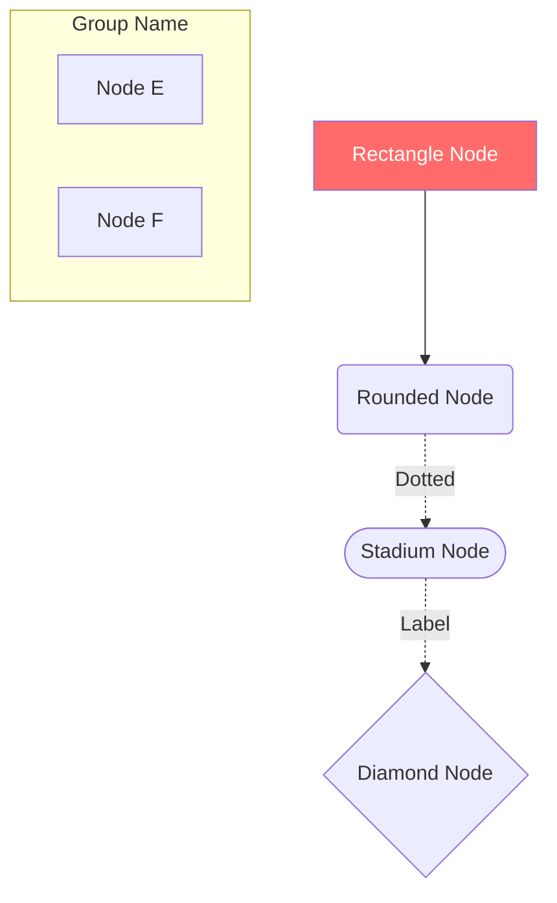

# Visual Documentation - Diagrams

This directory contains visual diagrams for the app's architecture, navigation flow, and component structure.

## 📊 Available Diagrams

### 1. [Sitemap Hierarchy](./sitemap-hierarchy.md)
**Purpose:** Complete visual map of all 61+ routes organized by 9-layer architecture

**Includes:**
- Full 9-layer navigation tree
- Route statistics by layer
- Color-coded layer identification
- Badge indicators (HOT, NEW, PRO)
- Layer characteristics and purposes

**Use Cases:**
- Understanding app structure
- Onboarding new developers
- Planning new features
- Route naming decisions

---

### 2. [Navigation Flow](./navigation-flow.md)
**Purpose:** User journey visualization and navigation patterns

**Includes:**
- **New Project Creation Flow** - End-to-end project setup
- **Service Booking Flow** - From browsing to checkout
- **AI Consultation Flow** - AI-assisted navigation
- **Deep Linking Flow** - Shared link handling
- **Analytics Tracking Flow** - Event tracking system
- **Error Handling Flow** - Route validation & recovery
- **Search Flow** - State machine diagram
- **Component Interaction** - How components communicate
- **Tab Navigation** - Tab switching patterns

**Use Cases:**
- UX optimization
- Feature planning
- Bug investigation
- User testing preparation

---

### 3. [Component Architecture](./component-architecture.md)
**Purpose:** Technical architecture and component relationships

**Includes:**
- **System Architecture** - High-level app structure
- **Navigation Components** - Class diagrams for nav components
- **Data Flow** - How data moves through the app
- **Performance Optimizations** - React.memo, lazy loading, etc.
- **Route Type System** - TypeScript type definitions
- **Dependency Graph** - File import relationships

**Use Cases:**
- Code refactoring
- Performance optimization
- Debugging circular dependencies
- Architecture reviews

---

### 4. [Route Dependency Graph](./route-dependency-graph.md)
**Purpose:** Route relationships and cross-layer navigation

**Includes:**
- **Route Relationships** - How routes connect
- **Dynamic Route Patterns** - Parameter-based routes
- **Authentication Gates** - Protected vs public routes
- **Feature Flags** - Conditional route availability
- **Metadata Structure** - Route metadata schema
- **Cross-Layer Patterns** - Navigation between layers
- **Usage Analysis** - Route priority quadrant chart

**Use Cases:**
- Route planning
- Access control implementation
- Feature flag management
- Usage analytics

---

## 🎨 Diagram Format

All diagrams use **Mermaid** syntax, which is supported by:
- ✅ GitHub (native rendering)
- ✅ VS Code (with Mermaid extension)
- ✅ GitLab
- ✅ Notion
- ✅ Confluence
- ✅ Most documentation platforms

### Viewing in VS Code

1. Install extension: `Markdown Preview Mermaid Support`
2. Open any diagram `.md` file
3. Press `Ctrl+Shift+V` (Windows) or `Cmd+Shift+V` (Mac)
4. View rendered diagram in preview pane

### Viewing on GitHub

Simply open any `.md` file in this folder on GitHub - diagrams render automatically!

### Exporting Diagrams

**Online Tools:**
- [Mermaid Live Editor](https://mermaid.live/) - Edit & export as PNG/SVG
- [Kroki](https://kroki.io/) - API for diagram generation

**CLI Tools:**
```bash
# Install mermaid-cli
npm install -g @mermaid-js/mermaid-cli

# Generate PNG
mmdc -i sitemap-hierarchy.md -o sitemap-hierarchy.png

# Generate SVG
mmdc -i navigation-flow.md -o navigation-flow.svg
```

---

## 🔄 Keeping Diagrams Updated

These diagrams should be updated when:

### Sitemap Hierarchy
- ❗ New route added to any layer
- ❗ Route removed or renamed
- ❗ Layer structure changes
- ✅ Badge added (HOT, NEW, PRO)

### Navigation Flow
- ❗ New user journey implemented
- ❗ Major UX flow changes
- ❗ Authentication flow updated
- ✅ New feature flag added

### Component Architecture
- ❗ New component created in `components/navigation/`
- ❗ Context provider added/removed
- ❗ Major refactoring
- ✅ Performance optimization implemented

### Route Dependency Graph
- ❗ New dynamic route pattern
- ❗ Route access control changes
- ❗ Cross-layer navigation added
- ✅ Usage patterns change significantly

---

## 🎯 Quick Reference

### Layer Colors

| Layer | Color | Hex Code | Use Case |
|-------|-------|----------|----------|
| 1 | 🔴 Red | `#FF6B6B` | Main Services |
| 2 | 🔵 Cyan | `#4ECDC4` | Construction |
| 3 | 🟣 Purple | `#6C5CE7` | Management |
| 4 | 🟡 Yellow | `#FDCB6E` | Finishing |
| 5 | 🟢 Green | `#00B894` | Professional |
| 6 | 🔵 Blue | `#0984E3` | Quick Tools |
| 7 | 🩷 Pink | `#FD79A8` | Shopping |
| 8 | 🟪 Lavender | `#A29BFE` | Additional |
| 9 | 💙 Sky | `#74B9FF` | Advanced |

### Diagram Syntax Cheat Sheet



---

## 📚 Additional Resources

### Mermaid Documentation
- [Official Docs](https://mermaid.js.org/)
- [Syntax Reference](https://mermaid.js.org/intro/syntax-reference.html)
- [Examples Gallery](https://mermaid.js.org/ecosystem/integrations.html)

### Related App Documentation
- [HOME_STRUCTURE_COMPLETE.md](../../HOME_STRUCTURE_COMPLETE.md) - Full home screen docs
- [NAVIGATION_ANALYTICS_GUIDE.md](../NAVIGATION_ANALYTICS_GUIDE.md) - Analytics system
- [ROUTE_MAPPING_AUDIT.md](../../ROUTE_MAPPING_AUDIT.md) - Route inventory

### Tools
- [VS Code Mermaid Extension](https://marketplace.visualstudio.com/items?itemName=bierner.markdown-mermaid)
- [Mermaid Live Editor](https://mermaid.live/)
- [Draw.io Mermaid Plugin](https://www.drawio.com/)

---

## 🤝 Contributing

When adding new diagrams:

1. **Create new `.md` file** in this directory
2. **Use descriptive filename** (e.g., `auth-flow.md`)
3. **Include purpose statement** at the top
4. **Use consistent styling** (follow existing color schemes)
5. **Add to this README** with description
6. **Test rendering** in VS Code and GitHub

### Diagram Template

```markdown
# [Diagram Name]

## Purpose
Brief description of what this diagram shows

## Diagram

\`\`\`mermaid
graph TD
    A[Start] --> B[End]
\`\`\`

## Use Cases
- Use case 1
- Use case 2

## Related Diagrams
- [Other Diagram](./other-diagram.md)
```

---

**Last Updated:** December 22, 2025  
**Maintained By:** Navigation System Team  
**Version:** 1.0.0
