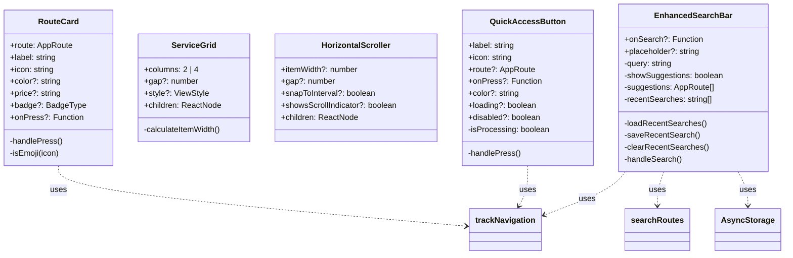
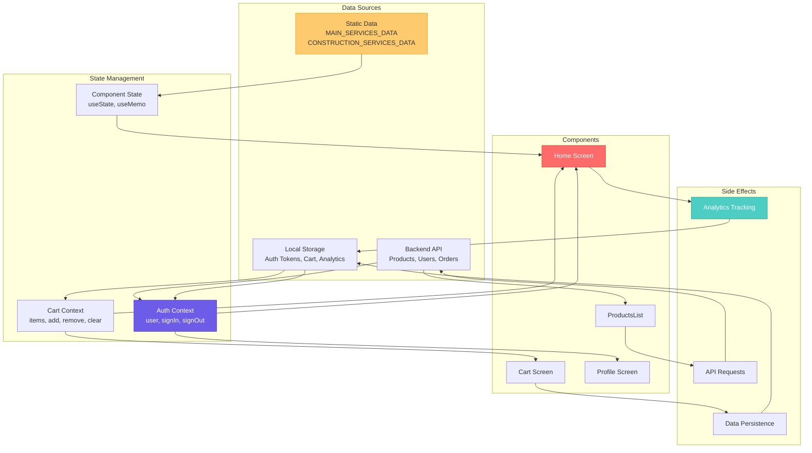
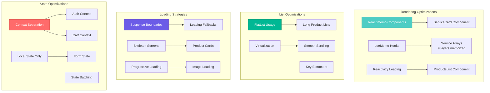
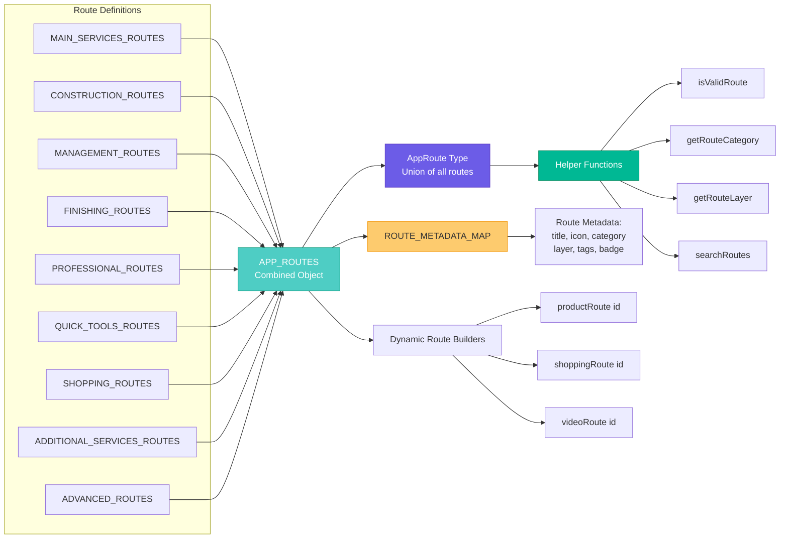
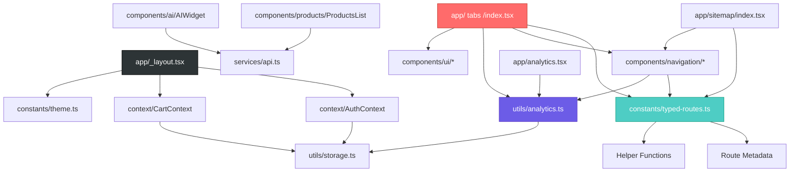

# Component Architecture

## System Architecture Overview

```mermaid
graph TB
    subgraph "App Root"
        Root[_layout.tsx<br/>Root Layout]
        Root --> AuthProvider[AuthProvider Context]
        AuthProvider --> CartProvider[CartProvider Context]
        CartProvider --> StackNav[Stack Navigator]
    end
    
    subgraph "Tab Navigation"
        StackNav --> Tabs[/(tabs)/_layout.tsx]
        Tabs --> Home[Home Screen]
        Tabs --> Projects[Projects Screen]
        Tabs --> Notifications[Notifications Screen]
        Tabs --> Profile[Profile Screen]
        Tabs -.Hidden.-> Menu4-9[Menu 4-9<br/>tabBarButton: null]
    end
    
    subgraph "Navigation System"
        TypedRoutes[constants/typed-routes.ts<br/>64+ Routes]
        Home --> TypedRoutes
        TypedRoutes --> AppRoutes[APP_ROUTES Object]
        TypedRoutes --> Helpers[Route Helpers:<br/>isValidRoute<br/>getRouteCategory<br/>searchRoutes]
    end
    
    subgraph "Navigation Components"
        Home --> NavComponents[components/navigation/]
        NavComponents --> RouteCard[RouteCard.tsx]
        NavComponents --> ServiceGrid[ServiceGrid.tsx]
        NavComponents --> HorizontalScroller[HorizontalScroller.tsx]
        NavComponents --> QuickAccessButton[QuickAccessButton.tsx]
        NavComponents --> EnhancedSearchBar[EnhancedSearchBar.tsx]
    end
    
    subgraph "Analytics System"
        Analytics[utils/analytics.ts]
        RouteCard --> Analytics
        QuickAccessButton --> Analytics
        Home --> Analytics
        Analytics --> AsyncStorage[(AsyncStorage)]
        Analytics --> AnalyticsDashboard[/analytics<br/>Dashboard Screen]
    end
    
    subgraph "UI Components"
        Home --> UIComponents[components/ui/]
        UIComponents --> Button[button.tsx]
        UIComponents --> Input[input.tsx]
        UIComponents --> Container[container.tsx]
        UIComponents --> Section[section.tsx]
        UIComponents --> Loader[loader.tsx]
    end
    
    subgraph "Feature Components"
        Home --> AI[components/ai/<br/>AIWidget]
        Home --> Products[components/products/<br/>ProductsList]
        Products -.Lazy Load.-> ProductsImpl[React.lazy +<br/>Suspense]
    end
    
    subgraph "API Layer"
        API[services/api.ts<br/>apiFetch wrapper]
        Products --> API
        AI --> API
        API --> Backend[(Backend API)]
    end
    
    subgraph "Storage"
        Storage[utils/storage.ts]
        Storage --> SecureStore[(Expo SecureStore)]
        Storage --> AsyncStorage
        AuthProvider --> Storage
        CartProvider --> Storage
    end
    
    style Root fill:#2D3436,stroke:#000,color:#fff
    style Home fill:#FF6B6B,stroke:#C0392B,color:#fff
    style TypedRoutes fill:#4ECDC4,stroke:#16A085,color:#fff
    style Analytics fill:#6C5CE7,stroke:#5F3DC4,color:#fff
    style NavComponents fill:#00B894,stroke:#00875A,color:#fff
```

## Navigation Component Details



## Data Flow Architecture



## Performance Optimization Architecture



## Route Type System



## Dependency Graph


