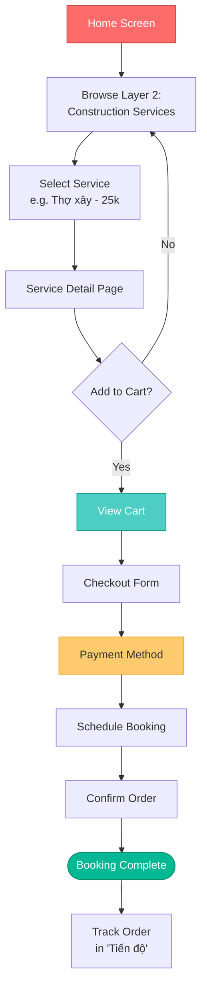
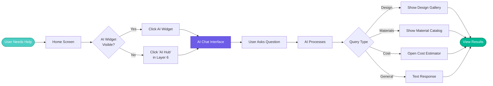
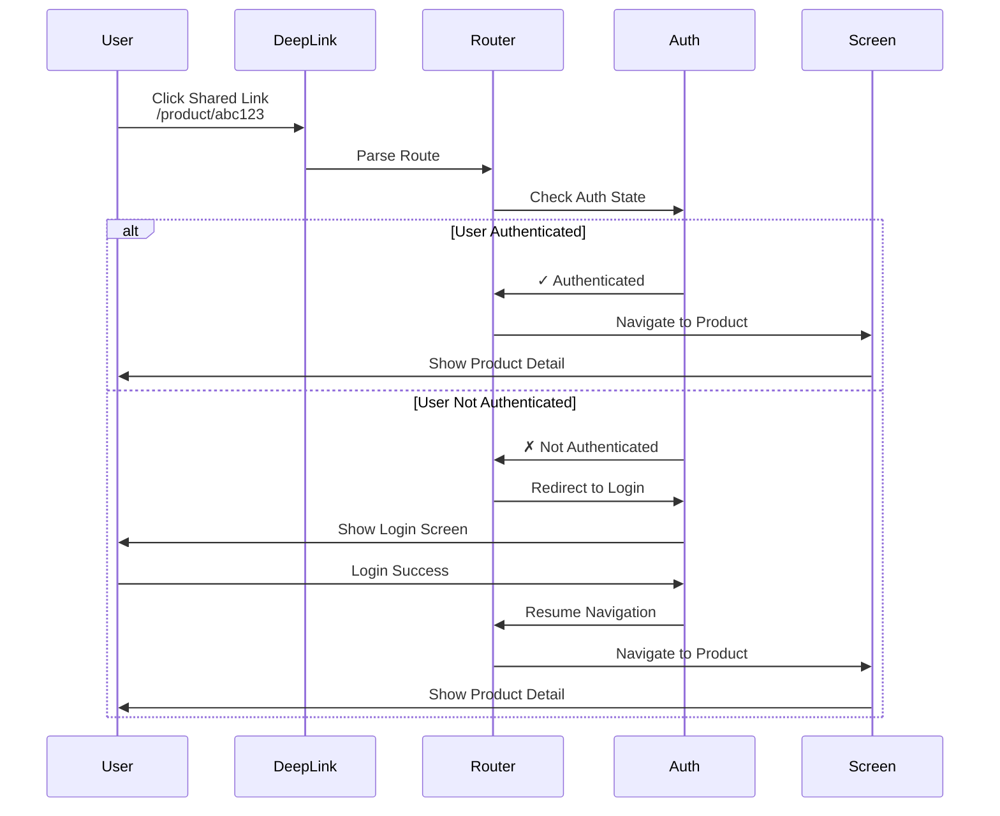
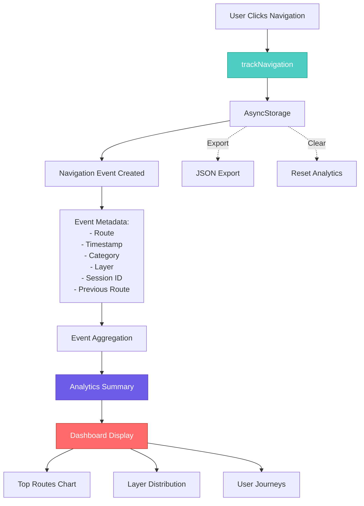
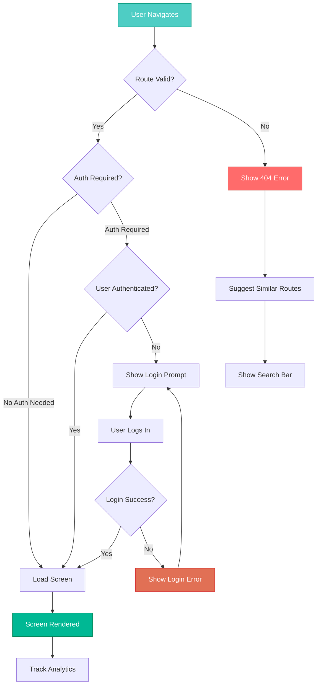
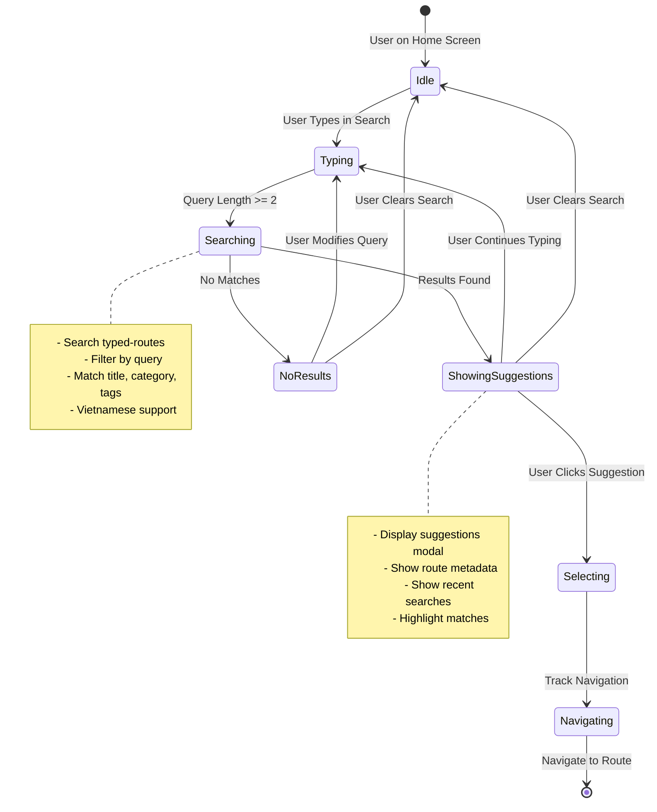
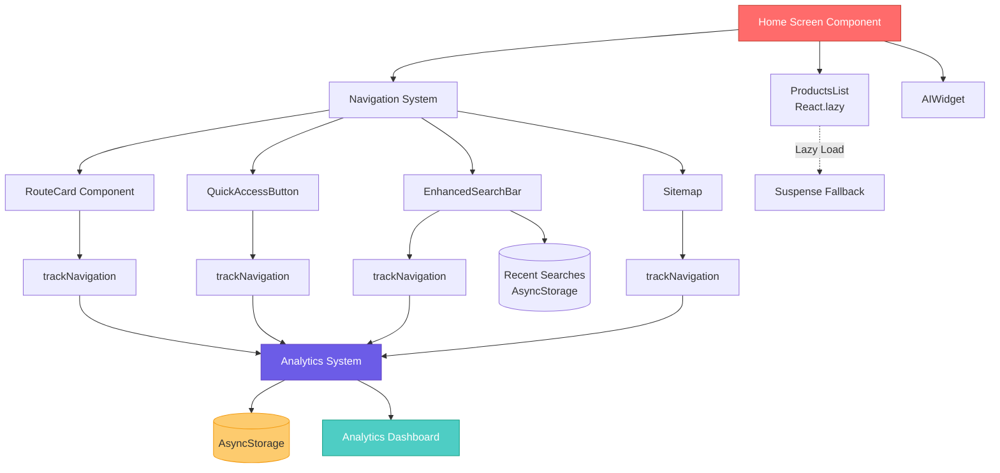
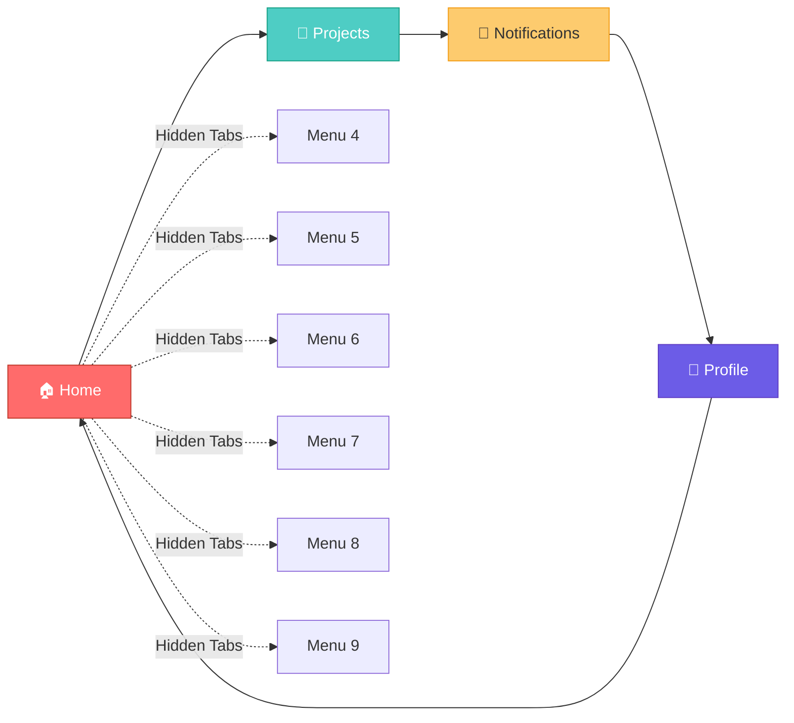

# Navigation Flow Diagrams

## User Journey: New Project Creation

```mermaid
graph LR
    Start([User Opens App]) --> Home[Home Screen]
    Home --> CreateProject[Click 'Dự án của tôi']
    CreateProject --> ProjectList[My Projects List]
    ProjectList --> NewProject[+ New Project]
    NewProject --> ProjectForm[Project Details Form]
    ProjectForm --> SelectDesign[Choose House Design]
    SelectDesign --> DesignGallery[Design Gallery]
    DesignGallery --> PickDesign[Select Design]
    PickDesign --> AddMaterials[Add Materials]
    AddMaterials --> MaterialCatalog[Materials Catalog]
    MaterialCatalog --> AddLabor[Add Labor]
    AddLabor --> LaborMarketplace[Labor Services]
    LaborMarketplace --> Review[Review & Submit]
    Review --> Success([Project Created])
    
    style Start fill:#4ECDC4,stroke:#16A085,color:#fff
    style Success fill:#00B894,stroke:#00875A,color:#fff
    style Home fill:#FF6B6B,stroke:#C0392B,color:#fff
    style ProjectForm fill:#FDCB6E,stroke:#F39C12,color:#333
    style Review fill:#6C5CE7,stroke:#5F3DC4,color:#fff
```

## User Journey: Service Booking

## User Journey: AI Consultation

## Navigation Pattern: Deep Linking

## Navigation Analytics Flow

## Error Handling Flow

## Search Flow

## Component Interaction Flow

## Tab Navigation Flow

