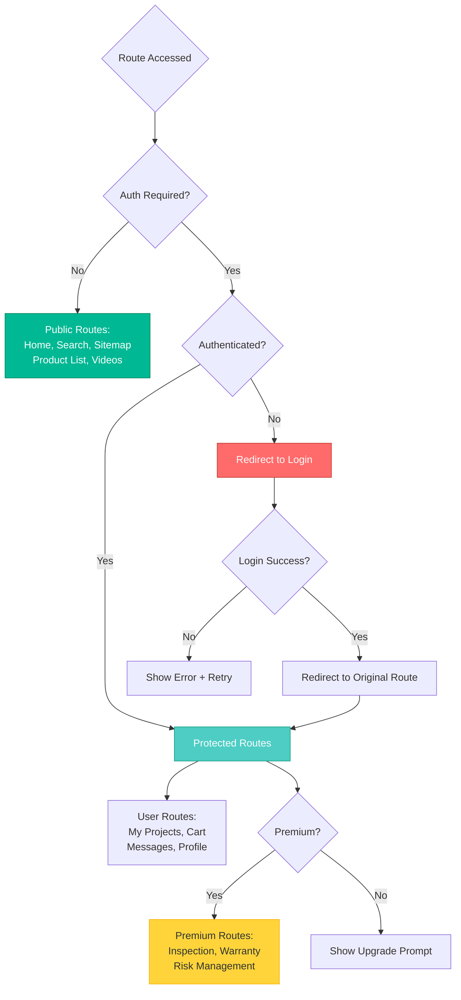
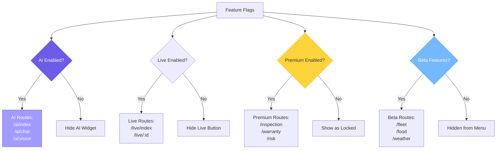
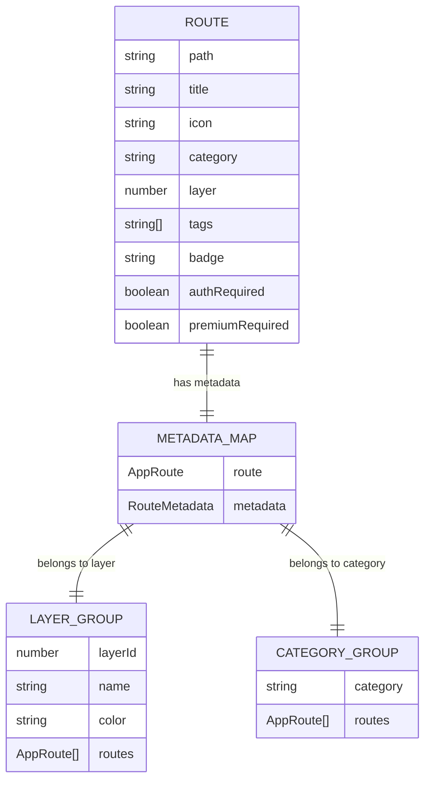
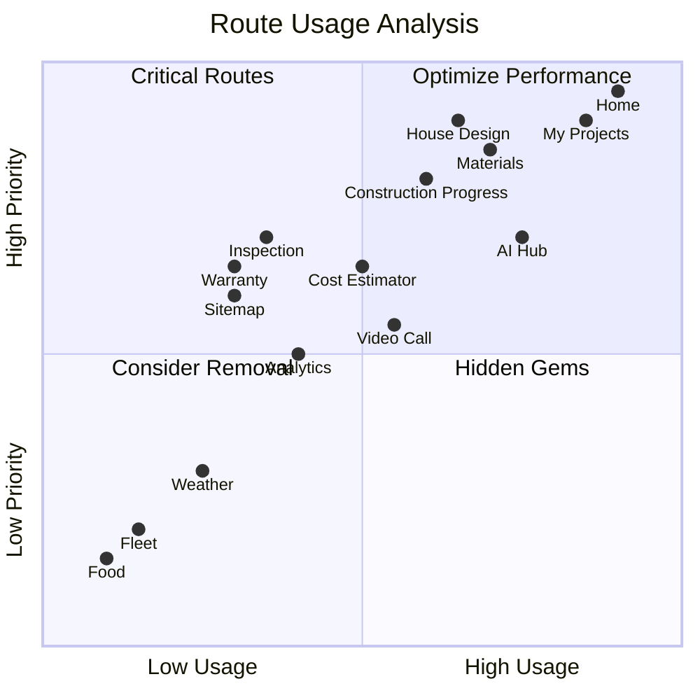

# Route Dependency Graph

## Route Relationships & Dependencies

```mermaid
graph TB
    subgraph "Entry Points"
        Home[Home Screen<br/>/ tabs /index]
        Sitemap[Sitemap<br/>/sitemap]
        Search[Search<br/>/search]
    end
    
    subgraph "Layer 1: Core Routes"
        L1_Design[/services/house-design]
        L1_Progress[/construction/progress]
        L1_Projects[/projects/my-projects]
        L1_Tracking[/tracking/index]
        L1_Materials[/materials/index]
        L1_Labor[/labor/index]
        L1_Quote[/quote/request]
    end
    
    subgraph "Layer 2: Services"
        L2_EpCoc[/construction/ep-coc]
        L2_DaoDat[/construction/dao-dat]
        L2_BeTong[/construction/be-tong]
        L2_VatLieu[/materials/construction]
        L2_ThoXay[/labor/tho-xay]
        L2_ThoDien[/labor/tho-dien-nuoc]
        L2_ThoCoffa[/labor/tho-coffa]
        L2_DesignTeam[/teams/design]
    end
    
    subgraph "Shopping Flow"
        L7_Materials[/shopping/construction-materials]
        L7_Electrical[/shopping/electrical]
        L7_Furniture[/shopping/furniture]
        L7_Paint[/shopping/paint]
        
        ProductDetail[/product/ id ]
        Cart[/cart]
        Checkout[/checkout]
    end
    
    subgraph "Project Flow"
        L1_Projects --> ProjectDetail[/projects/ id ]
        ProjectDetail --> ProjectEdit[/projects/ id /edit]
        ProjectDetail --> ProjectTimeline[/projects/ id /timeline]
        ProjectDetail --> ProjectBudget[/projects/ id /budget]
    end
    
    subgraph "AI Integration"
        L6_AIHub[/ai/index]
        L6_AIHub --> AIChat[/ai/chat]
        L6_AIHub --> AIVision[/ai/vision]
        L6_AIHub --> AIReport[/ai/report]
    end
    
    subgraph "Communication"
        L6_Messages[/messages/index]
        L6_Messages --> Chat[/messages/ id ]
        L8_VideoCall[/call/active]
        L6_LiveStream[/live/index]
    end
    
    subgraph "Analytics & Tools"
        L8_Analytics[/analytics]
        L6_Estimator[/tools/cost-estimator]
        L6_QR[/qr/my-code]
        L6_Map[/map/view]
    end
    
    %% Home connections
    Home --> L1_Design
    Home --> L1_Progress
    Home --> L1_Projects
    Home --> L1_Materials
    Home --> L2_EpCoc
    Home --> L2_ThoXay
    Home --> L6_AIHub
    Home --> L7_Materials
    Home --> L8_Analytics
    
    %% Search connections
    Search -.Search Results.-> L1_Design
    Search -.Search Results.-> L2_ThoXay
    Search -.Search Results.-> L7_Materials
    
    %% Shopping flow
    L7_Materials --> ProductDetail
    L7_Electrical --> ProductDetail
    L7_Furniture --> ProductDetail
    L7_Paint --> ProductDetail
    ProductDetail --> Cart
    Cart --> Checkout
    
    %% Service booking flow
    L2_ThoXay --> ServiceBooking[Service Booking]
    L2_ThoDien --> ServiceBooking
    L2_ThoCoffa --> ServiceBooking
    ServiceBooking --> Cart
    
    %% Cross-layer connections
    L1_Materials --> L7_Materials
    L1_Labor --> L2_ThoXay
    L1_Design --> L6_AIHub
    L1_Projects --> L1_Tracking
    
    style Home fill:#FF6B6B,stroke:#C0392B,color:#fff
    style L1_Projects fill:#4ECDC4,stroke:#16A085,color:#fff
    style L6_AIHub fill:#6C5CE7,stroke:#5F3DC4,color:#fff
    style Cart fill:#00B894,stroke:#00875A,color:#fff
    style L8_Analytics fill:#0984E3,stroke:#0652DD,color:#fff
```

## Dynamic Route Patterns

```mermaid
graph LR
    subgraph "Dynamic Product Routes"
        Products[/products] --> Product[/product/:id]
        Product --> P1[/product/001]
        Product --> P2[/product/002]
        Product --> P3[/product/...]
    end
    
    subgraph "Dynamic Project Routes"
        Projects[/projects] --> Project[/projects/:id]
        Project --> Proj1[/projects/abc123]
        Project --> Proj2[/projects/xyz789]
        Project --> ProjEdit[/projects/:id/edit]
        Project --> ProjTimeline[/projects/:id/timeline]
    end
    
    subgraph "Dynamic Shopping Routes"
        Shopping[/shopping] --> Category[/shopping/:category]
        Category --> Shop1[/shopping/construction-materials]
        Category --> Shop2[/shopping/electrical]
        Category --> ShopDetail[/shopping/:category/:id]
    end
    
    subgraph "Dynamic Video Routes"
        Videos[/videos] --> Video[/videos/:id]
        Video --> V1[/videos/tutorial-001]
        Video --> V2[/videos/demo-002]
    end
    
    subgraph "Dynamic Live Routes"
        Live[/live] --> Stream[/live/:id]
        Stream --> L1[/live/stream-001]
        Stream --> L2[/live/stream-002]
    end
    
    style Products fill:#4ECDC4,stroke:#16A085,color:#fff
    style Projects fill:#FF6B6B,stroke:#C0392B,color:#fff
    style Shopping fill:#00B894,stroke:#00875A,color:#fff
    style Videos fill:#FDCB6E,stroke:#F39C12,color:#333
    style Live fill:#6C5CE7,stroke:#5F3DC4,color:#fff
```

## Authentication-Gated Routes



## Feature Flag Dependencies



## Route Metadata Structure



## Cross-Layer Navigation Patterns

```mermaid
sankey-beta

%% Layer 1 → Other Layers
Home,L1 Design,15
Home,L1 Projects,20
Home,L1 Materials,18
Home,L1 Labor,12

%% Layer 1 → Layer 2
L1 Design,L2 Design Team,8
L1 Materials,L2 Materials,10
L1 Labor,L2 Workers,15

%% Layer 1 → Layer 6
L1 Projects,L6 Cost Estimator,12
L1 Design,L6 AI Hub,18

%% Layer 2 → Shopping (Layer 7)
L2 Materials,L7 Shopping,20
L2 Workers,Service Booking,15

%% Shopping → Cart → Checkout
L7 Shopping,Product Detail,25
Product Detail,Cart,20
Cart,Checkout,18

%% AI Integration
L6 AI Hub,AI Chat,15
L6 AI Hub,AI Vision,10
AI Chat,L1 Design,8
AI Vision,L2 Materials,7

%% Analytics
All Screens,L8 Analytics,30
```

## Route Priority & Frequency


