# 9-Layer Architecture - Sitemap Hierarchy

## Visual Sitemap Diagram

```mermaid
graph TD
    Root[Home Screen<br/>9-Layer Architecture]
    
    %% LAYER 1: Main Services
    Root --> L1[LAYER 1: Main Services<br/>8 routes]
    L1 --> L1_1[🏠 House Design]
    L1 --> L1_2[🏗️ Construction Progress]
    L1 --> L1_3[📁 My Projects]
    L1 --> L1_4[📊 Tracking]
    L1 --> L1_5[🧱 Materials]
    L1 --> L1_6[👷 Labor]
    L1 --> L1_7[💰 Quote Request]
    L1 --> L1_8[🗺️ Sitemap]
    
    %% LAYER 2: Construction Services
    Root --> L2[LAYER 2: Construction Services<br/>8 routes]
    L2 --> L2_1[⚡ Ép cọc - 15k]
    L2 --> L2_2[🚜 Đào đất - 12k]
    L2 --> L2_3[🏗️ Bê tông - 18k]
    L2 --> L2_4[📦 Vật liệu XD - 10k]
    L2 --> L2_5[👷‍♂️ Thợ xây - 25k]
    L2 --> L2_6[⚡ Thợ điện - 22k]
    L2 --> L2_7[🔨 Cốp pha - 20k]
    L2 --> L2_8[👥 Design Team - 30k]
    
    %% LAYER 3: Management Tools
    Root --> L3[LAYER 3: Management Tools<br/>8 routes]
    L3 --> L3_1[Timeline]
    L3 --> L3_2[Budget]
    L3 --> L3_3[QC/QA]
    L3 --> L3_4[Safety]
    L3 --> L3_5[Documents]
    L3 --> L3_6[Reports]
    L3 --> L3_7[RFI]
    L3 --> L3_8[Submittal]
    
    %% LAYER 4: Finishing Works
    Root --> L4[LAYER 4: Finishing Works<br/>8 routes]
    L4 --> L4_1[Lát gạch - HOT]
    L4 --> L4_2[Sơn tường - NEW]
    L4 --> L4_3[Đá tự nhiên]
    L4 --> L4_4[Thạch cao - HOT]
    L4 --> L4_5[Làm cửa]
    L4 --> L4_6[Lan can]
    L4 --> L4_7[Camera - NEW]
    L4 --> L4_8[Thợ tổng hợp]
    
    %% LAYER 5: Professional Services
    Root --> L5[LAYER 5: Professional Services<br/>4 routes]
    L5 --> L5_1[Interior Design]
    L5 --> L5_2[Architecture]
    L5 --> L5_3[Quality Supervision]
    L5 --> L5_4[Feng Shui]
    
    %% LAYER 6: Quick Tools
    Root --> L6[LAYER 6: Quick Tools<br/>8 routes]
    L6 --> L6_1[Cost Estimator]
    L6 --> L6_2[QR Code]
    L6 --> L6_3[Map View - NEW]
    L6 --> L6_4[Store Locator]
    L6 --> L6_5[AI Hub - NEW]
    L6 --> L6_6[Live Stream]
    L6 --> L6_7[Videos]
    L6 --> L6_8[Messages]
    
    %% LAYER 7: Shopping
    Root --> L7[LAYER 7: Shopping Categories<br/>4 routes]
    L7 --> L7_1[🏗️ Construction Materials]
    L7 --> L7_2[⚡ Electrical Equipment]
    L7 --> L7_3[🛋️ Furniture]
    L7 --> L7_4[🎨 Paint & Colors]
    
    %% LAYER 8: Additional Services
    Root --> L8[LAYER 8: Additional Services<br/>9 routes]
    L8 --> L8_1[📅 Booking]
    L8 --> L8_2[📞 Video Call]
    L8 --> L8_3[🔔 Notifications]
    L8 --> L8_4[📊 Analytics]
    L8 --> L8_5[📄 Contracts]
    L8 --> L8_6[🌤️ Weather]
    L8 --> L8_7[🚗 Fleet]
    L8 --> L8_8[🍽️ Food]
    L8 --> L8_9[💬 Chat]
    
    %% LAYER 9: Advanced Features
    Root --> L9[LAYER 9: Advanced Features<br/>4 routes]
    L9 --> L9_1[Inspection - PRO]
    L9 --> L9_2[Warranty - PRO]
    L9 --> L9_3[Risk Management]
    L9 --> L9_4[Legal - NEW]
    
    %% Styling
    classDef layer1 fill:#FF6B6B,stroke:#C0392B,color:#fff
    classDef layer2 fill:#4ECDC4,stroke:#16A085,color:#fff
    classDef layer3 fill:#6C5CE7,stroke:#5F3DC4,color:#fff
    classDef layer4 fill:#FDCB6E,stroke:#F39C12,color:#333
    classDef layer5 fill:#00B894,stroke:#00875A,color:#fff
    classDef layer6 fill:#0984E3,stroke:#0652DD,color:#fff
    classDef layer7 fill:#FD79A8,stroke:#E84393,color:#fff
    classDef layer8 fill:#A29BFE,stroke:#6C5CE7,color:#fff
    classDef layer9 fill:#74B9FF,stroke:#0984E3,color:#fff
    classDef root fill:#2D3436,stroke:#000,color:#fff
    
    class Root root
    class L1,L1_1,L1_2,L1_3,L1_4,L1_5,L1_6,L1_7,L1_8 layer1
    class L2,L2_1,L2_2,L2_3,L2_4,L2_5,L2_6,L2_7,L2_8 layer2
    class L3,L3_1,L3_2,L3_3,L3_4,L3_5,L3_6,L3_7,L3_8 layer3
    class L4,L4_1,L4_2,L4_3,L4_4,L4_5,L4_6,L4_7,L4_8 layer4
    class L5,L5_1,L5_2,L5_3,L5_4 layer5
    class L6,L6_1,L6_2,L6_3,L6_4,L6_5,L6_6,L6_7,L6_8 layer6
    class L7,L7_1,L7_2,L7_3,L7_4 layer7
    class L8,L8_1,L8_2,L8_3,L8_4,L8_5,L8_6,L8_7,L8_8,L8_9 layer8
    class L9,L9_1,L9_2,L9_3,L9_4 layer9
```

## Layer Statistics

| Layer | Name | Routes | Color | Priority |
|-------|------|--------|-------|----------|
| 1 | Main Services | 8 | 🔴 Red | High |
| 2 | Construction Services | 8 | 🔵 Cyan | High |
| 3 | Management Tools | 8 | 🟣 Purple | Medium |
| 4 | Finishing Works | 8 | 🟡 Yellow | Medium |
| 5 | Professional Services | 4 | 🟢 Green | Medium |
| 6 | Quick Tools | 8 | 🔵 Blue | Low |
| 7 | Shopping Categories | 4 | 🩷 Pink | Low |
| 8 | Additional Services | 9 | 🟪 Lavender | Low |
| 9 | Advanced Features | 4 | 💙 Sky | Premium |

**Total Routes:** 61+ (excluding dynamic routes)

## Route Characteristics

### Layer 1: Core Features
- **Purpose:** Essential app functions
- **Access:** Direct from home screen grid
- **Users:** All users
- **Examples:** House Design, My Projects, Materials

### Layer 2: Service Marketplace
- **Purpose:** Price-based construction services
- **Access:** Grid with pricing
- **Users:** Contractors, homeowners
- **Examples:** Ép cọc (15k), Thợ xây (25k)

### Layer 3: Professional Tools
- **Purpose:** Project management utilities
- **Access:** Tool cards with icons
- **Users:** Project managers, teams
- **Examples:** Timeline, Budget, QC/QA

### Layer 4: Interior Services
- **Purpose:** Finishing & decoration work
- **Access:** Horizontal scroll
- **Users:** Interior specialists
- **Examples:** Lát gạch, Sơn tường, Thạch cao

### Layer 5: Expert Consultants
- **Purpose:** Professional consultation services
- **Access:** Card list with images
- **Users:** Premium clients
- **Examples:** Interior Design, Architecture, Feng Shui

### Layer 6: Utilities
- **Purpose:** Quick access tools
- **Access:** Icon grid
- **Users:** All users
- **Examples:** Cost Estimator, QR Code, AI Hub

### Layer 7: E-commerce
- **Purpose:** Product shopping categories
- **Access:** Category cards
- **Users:** Buyers
- **Examples:** Construction Materials, Furniture

### Layer 8: Extended Features
- **Purpose:** Additional utilities
- **Access:** Secondary grid
- **Users:** Advanced users
- **Examples:** Booking, Video Call, Analytics

### Layer 9: Premium Features
- **Purpose:** Advanced paid features
- **Access:** Premium cards with badges
- **Users:** Enterprise clients
- **Examples:** Inspection (PRO), Warranty (PRO)
